<div align="center">

# Deep Dive into Claude Code

### 从源码出发，全面解读 AI 编程助手的架构与实现

<br/>


*基于 Claude Code 完整源码的逐文件深度分析 | 22 章 | 4,000+ 行*

</div>

---

> **目标读者**: 对 AI 编程助手内部机制感兴趣的开发者。不要求有 Claude Code 使用经验。
>
> **阅读建议**: 第一、二部分是理解全局的基础，建议顺序阅读。第三部分以后可以按兴趣跳读。

---

## 目录

### 第一部分: 认识 Claude Code
> *从零开始了解: 它是什么，能做什么，怎么做到的*

- [第 1 章: Claude Code 是什么？](#第-1-章-claude-code-是什么)
- [第 2 章: 项目全景鸟瞰](#第-2-章-项目全景鸟瞰)

### 第二部分: 启动与运行
> *从你按下回车到 Claude 回复你，中间发生了什么*

- [第 3 章: 一条命令背后发生了什么——启动流程](#第-3-章-一条命令背后发生了什么启动流程)
- [第 4 章: 对话的心脏——核心会话循环](#第-4-章-对话的心脏核心会话循环)
- [第 5 章: 记住一切——全局状态管理](#第-5-章-记住一切全局状态管理)

### 第三部分: 工具与能力
> *Claude 怎么"动手干活"——44 个工具、权限安全、可编程拦截*

- [第 6 章: Claude 的工具箱——工具系统](#第-6-章-claude-的工具箱工具系统)
- [第 7 章: 安全卫士——权限系统](#第-7-章-安全卫士权限系统)
- [第 8 章: 可编程的拦截器——Hook 系统](#第-8-章-可编程的拦截器hook-系统)

### 第四部分: 多智能体协作
> *一个 Claude 不够用？派出分身、组建团队、指挥协作*

- [第 9 章: 分身术——Agent 子智能体](#第-9-章-分身术agent-子智能体)
- [第 10 章: 组建团队——Team/Swarm 系统](#第-10-章-组建团队teamswarm-系统)
- [第 11 章: 指挥官模式——Coordinator](#第-11-章-指挥官模式coordinator)

### 第五部分: 扩展与连接
> *连接 Slack、GitHub、数据库——Claude 的"万能接口"*

- [第 12 章: 万能插座——MCP 协议](#第-12-章-万能插座mcp-协议)
- [第 13 章: 技能与命令——Skill 系统](#第-13-章-技能与命令skill-系统)
- [第 14 章: 乐高式扩展——插件系统](#第-14-章-乐高式扩展插件系统)

### 第六部分: 记忆与智慧
> *Claude 怎么记住你、整理知识、管理超长对话*

- [第 15 章: 跨会话的大脑——Memory 系统](#第-15-章-跨会话的大脑memory-系统)
- [第 16 章: 睡梦中的整理——自动记忆提取与 Auto-Dream](#第-16-章-睡梦中的整理自动记忆提取与-auto-dream)
- [第 17 章: 不会忘记的对话——上下文窗口管理](#第-17-章-不会忘记的对话上下文窗口管理)

### 第七部分: 高级模式
> *KAIROS 自主助手、远程控制、分布式执行*

- [第 18 章: 永不休息的助手——KAIROS 模式](#第-18-章-永不休息的助手kairos-模式)
- [第 19 章: 远程控制——Bridge 与分布式架构](#第-19-章-远程控制bridge-与分布式架构)

### 第八部分: 用户界面与体验
> *终端里的 React、Vim 模式、你的 ASCII 小伙伴*

- [第 20 章: 终端也能很美——Ink 渲染引擎](#第-20-章-终端也能很美ink-渲染引擎)
- [第 21 章: 你的小伙伴——Buddy 精灵系统](#第-21-章-你的小伙伴buddy-精灵系统)

### 第九部分: 工程基础设施
> *构建系统、feature() 门控、Stubs 机制*

- [第 22 章: 构建系统与 Stubs 机制](#第-22-章-构建系统与-stubs-机制)

---

# 🌟 第一部分: 认识 Claude Code

## 第 1 章: Claude Code 是什么？

### 1.1 从一个场景说起

想象你刚加入一个团队，面对一个 50 万行代码的项目。你的第一个任务是："登录页面偶尔会 500 报错，查一下什么原因。"

**传统做法**——你可能需要:
1. `grep -r "login" src/` 搜索相关文件
2. 打开十几个文件，逐个阅读
3. 找到疑似问题后，自己想修复方案
4. 手动编写修复代码
5. 运行测试确认
6. 编写 commit message，提交代码

整个过程可能花费几个小时。

**用 Claude Code 的做法**——你在终端里输入:

```
claude
> 登录页面偶尔 500 报错，帮我查一下原因并修复
```

接下来 Claude Code 会**自己完成所有步骤**:

```
Claude: 让我先搜索登录相关的代码
  → [调用 Grep 工具] 搜索 "login" 和 "auth"
  → [调用 Read 工具] 阅读 src/auth/loginController.ts
  → [调用 Read 工具] 阅读 src/auth/sessionValidator.ts

Claude: 找到了。sessionValidator.ts 第 87 行在并发请求时
        有竞态条件——两个请求同时检查 session，第二个会拿到空值。
  → [调用 Edit 工具] 修改 sessionValidator.ts，添加锁机制
  → [调用 Bash 工具] 运行 npm test
  → 测试全部通过

Claude: "修复完成。问题是 sessionValidator.ts:87 的竞态条件，
         两个并发请求同时验证 session 时第二个会拿到 null。
         我添加了一个互斥锁来确保串行化。测试全部通过。"
```

**Claude Code 是一个运行在终端里的 AI 编程助手**。它不是一个聊天窗口——它能**直接操作**你的文件系统、运行 Shell 命令、读写代码、搜索文件、调用 API。

### 1.2 它和普通 AI 聊天有什么本质区别？

市面上很多工具可以和 AI 聊代码，但它们大多是"你贴代码给 AI，AI 贴修改后的代码给你，你手动粘回去"。Claude Code 的根本区别是:

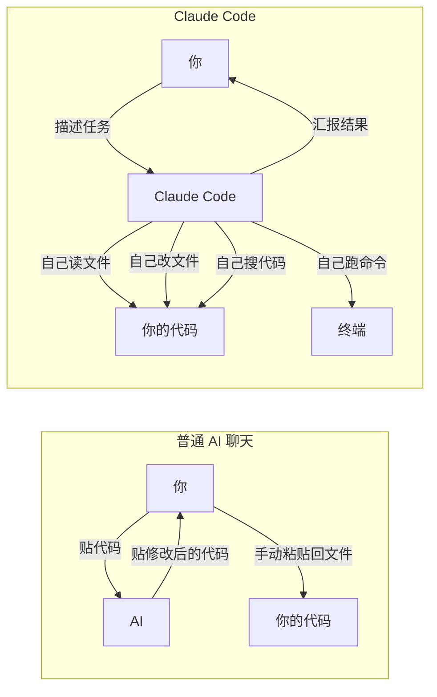

关键差异:

| | 普通 AI 聊天 | Claude Code |
|---|---|---|
| **谁读代码** | 你复制粘贴给 AI | Claude 自己用 Read/Grep/Glob 工具读 |
| **谁改代码** | 你手动粘回去 | Claude 自己用 Edit/Write 工具改 |
| **谁跑测试** | 你手动执行 | Claude 自己用 Bash 工具跑 |
| **上下文** | 你粘贴了多少它就看到多少 | Claude 可以翻遍整个代码库 |
| **多步骤** | 每步都需要你中转 | Claude 自己循环: 读→分析→改→测试→汇报 |

### 1.3 Harness 架构: Claude Code 的"骨架"

Claude Code 之所以能"自己干活"，靠的是一个叫 **Harness（编排引擎）** 的架构。

**日常比喻**: 如果 Claude 的大脑是 AI 模型，那 Harness 就是它的**神经系统和骨骼**——负责把"我想读一个文件"的想法变成"真的去读了这个文件并把内容传回大脑"的行动。

Harness 做的事情包括:

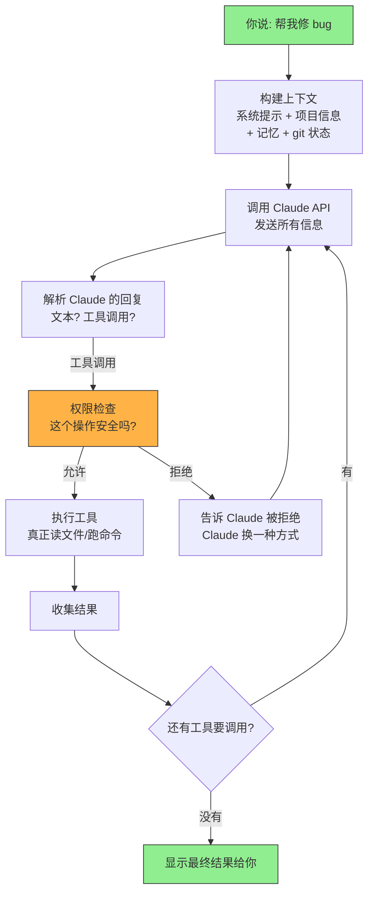

这个流程不是预编程的固定步骤——Claude 在每一轮都能**自主决定**下一步做什么。它可能读一个文件后发现需要再读三个文件，然后再修改两个文件，再跑测试。Harness 负责让这个循环安全、高效地运行。

### 1.4 六大核心能力

从源码看，Claude Code 有六大核心能力，每个都由独立的模块实现:

**能力 1: 工具执行** — 44 个内置工具

Claude 不是直接操作你的电脑，而是通过"工具"来干活。每个工具做一件事:

```
Bash     → 运行任何 Shell 命令 (npm test, git commit, ls 等)
Read     → 读取文件内容
Edit     → 精确替换文件中的一段文本
Write    → 创建新文件
Glob     → 按模式查找文件 (如 "src/**/*.ts")
Grep     → 在文件内容中搜索关键词
Agent    → 派出一个子 Agent 做子任务
WebSearch → 搜索互联网
...还有 36 个
```

源码位置: `src/tools/` 目录下有 44 个子目录，每个就是一个工具。

**能力 2: 多智能体协作** — 派出多个"分身"

当任务很大时，Claude 可以同时派出多个子 Agent 并行工作:

```
你: "重构 auth 模块，同时写 API 测试"

Claude (主体):
  +-- 派 Explore Agent → 快速搜索 auth 模块结构 (用 Haiku 模型，更快)
  +-- 派 general-purpose Agent → 写 API 测试
  +-- 自己 → 等结果汇总后做最终重构
```

源码位置: `src/tools/AgentTool/` 和 `src/utils/swarm/`

**能力 3: 多层权限安全** — 防止误操作

每次 Claude 要做可能有风险的操作时，都会经过权限检查:

```
Claude 想执行 rm -rf node_modules
  → 检查规则: 有没有 deny 规则匹配？
  → 检查模式: 当前是 default 模式？需要用户确认
  → 弹出提示: "Claude 想要执行 rm -rf node_modules，允许吗？"
```

源码位置: `src/utils/permissions/` 目录，24 个文件

**能力 4: 跨会话记忆** — 记住你的偏好

Claude Code 能记住上次对话中你说的话，下次不用重复:

```
[上次会话] 你: "我们团队禁止在测试中用 mock"
[这次会话] Claude 自动记住这个规则，写测试时用真实数据库
```

源码位置: `src/memdir/` 目录（记忆存储和注入）、`src/services/extractMemories/`（自动提取）、`src/services/autoDream/`（定期整理）

**能力 5: 外部工具连接 (MCP)** — 连接 Slack、GitHub 等

通过 MCP (Model Context Protocol) 协议，Claude Code 可以连接任何外部服务:

```json
// .mcp.json —— 配置一个 GitHub MCP 服务器
{
  "mcpServers": {
    "github": {
      "type": "stdio",
      "command": "npx",
      "args": ["-y", "@modelcontextprotocol/server-github"]
    }
  }
}
```

配置后，Claude 就能:
```
Claude: 让我查看 PR #42 的评论
  → [调用 mcp__github__list_pr_comments]
```

源码位置: `src/services/mcp/` 目录（23 个文件）

**能力 6: 可编程的拦截点 (Hooks)** — 在任何步骤插入自定义逻辑

你可以在 Claude 执行任何工具之前/之后插入自己的脚本:

```json
// settings.json
{
  "hooks": {
    "PreToolUse": [{
      "matcher": "Bash",
      "hooks": [{
        "type": "command",
        "command": "./my-safety-check.sh"
      }]
    }]
  }
}
```

每次 Claude 要执行 Bash 命令前，先跑你的安全检查脚本。

源码位置: `src/utils/hooks.ts`（5,022 行，Hook 执行引擎）和 `src/schemas/hooks.ts`（Hook 定义格式）

### 1.5 多种运行形态

Claude Code 不只是一个终端工具，它有多种运行方式:

| 形态 | 怎么用 | 适合场景 |
|------|--------|---------|
| **交互模式** | `claude` | 坐在终端前，来回对话 |
| **非交互模式** | `claude -p "你的问题"` | 脚本调用，一次性任务 |
| **KAIROS 模式** | `claude --assistant` | 常驻后台助手，自动巡检 |
| **远程控制** | `claude remote-control` | 在 claude.ai 网页控制本地机器 |
| **MCP 服务器** | `claude --mcp` | 作为 MCP 服务端被其他工具调用 |
| **守护进程** | `claude daemon` | 长驻后台运行 |

这些形态共享同一套核心代码，只是入口和交互方式不同。源码中通过 `cli.tsx` 的快速路径分发来决定进入哪种模式（详见第 3 章）。

### 1.6 技术栈——用日常语言解释

| 技术 | 是什么 | 为什么选它 |
|------|--------|-----------|
| **TypeScript** | JavaScript 的类型增强版 | 52 万行代码没有类型约束会崩溃 |
| **Bun** | JavaScript/TypeScript 运行时 | 比 Node.js 启动更快，原生支持 TypeScript |
| **React + Ink** | UI 框架 | React 大家都熟；Ink 让它能在终端里画界面 |
| **Yoga** | 布局引擎 | Facebook 的 Flexbox 布局，计算终端里组件的位置 |
| **Zod** | 运行时类型检查 | 确保工具输入格式正确（比如 Bash 工具必须有 command 字段） |
| **Commander.js** | 命令行参数解析 | 解析 `claude --version`、`claude -p "..."` 等参数 |
| **@anthropic-ai/sdk** | Claude API 客户端 | 和 Claude 大脑通信 |

**多 AI 供应商支持**: Claude Code 不只能连 Anthropic 直连 API，还支持:
- **AWS Bedrock** (通过 `@anthropic-ai/bedrock-sdk`)
- **Google Vertex AI** (通过 `@anthropic-ai/vertex-sdk`)
- **Azure Foundry** (通过 `foundry-sdk`)

源码中 `src/services/api/client.ts` 有一个 `getAnthropicClient()` 函数，根据你的配置自动选择正确的客户端。

---

## 第 2 章: 项目全景鸟瞰

### 2.1 整体规模感受

在深入细节之前，先对这个项目有一个直觉上的感受:

| 维度 | 数据 | 感性认知 |
|------|------|---------|
| 文件总数 | 2,009 个 | 约等于一本 5,000 页的书 |
| 代码行数 | ~520,000 行 TypeScript | 如果打印出来，叠起来超过 50 米高 |
| src/ 子目录 | 35 个 | 每个是一个独立的功能模块 |
| 内置工具 | 44 个 | 从读文件到搜索网页，覆盖开发全流程 |
| 服务模块 | 20 个 | API、MCP、分析、压缩、记忆提取等 |
| React 组件 | 144 个 | 终端 UI 界面元素 |
| 命令 | 87 个 | `/commit`、`/review`、`/memory` 等斜杠命令 |

最大的单个文件是 `src/screens/REPL.tsx`（5,005 行）——这是主交互界面的实现。最复杂的是 `src/utils/hooks.ts`（5,022 行）——Hook 系统的执行引擎。

### 2.2 项目结构的"公司比喻"

把 Claude Code 想象成一家公司，每个目录就是一个部门:

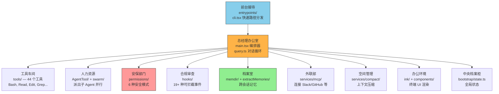

### 2.3 每个"部门"具体做什么？

下面逐一介绍，每个都标注了源码位置和文件规模，方便你以后深入查看。

#### 前台接待: entrypoints/ (14 个文件)

**干什么**: 你输入 `claude` 命令后，第一个碰到的就是这里。它快速判断你要做什么，把你导向正确的处理流程。

**关键文件**:
- `cli.tsx` (302 行) — 入口，快速路径分发器
- `init.ts` (340 行) — 初始化逻辑（身份验证、遥测、配置等）
- `mcp.ts` — 当 Claude Code 作为 MCP 服务器运行时的入口

**具体例子**: 你输入 `claude --version`，cli.tsx 一看是 `--version`，直接输出版本号就返回了，不需要加载任何其他模块。但如果你输入 `claude` 没带参数，它会动态导入 `main.tsx`，启动完整的交互界面。

#### 总经理办公室: main.tsx + query.ts

**干什么**: 整个应用的核心编排。main.tsx 负责初始化一切，query.ts 负责驱动对话循环。

**关键文件**:
- `main.tsx` (4,685 行) — 主编排器，初始化工具、MCP、权限等
- `query.ts` (1,729 行) — 核心对话循环引擎（`while(true)` 循环）
- `QueryEngine.ts` (1,295 行) — 多轮会话编排器（供 SDK 使用）

**它们的关系**: `main.tsx` 是"开公司"（初始化所有资源），`query.ts` 是"每天的工作"（处理每一轮用户输入），`QueryEngine.ts` 是"给合作伙伴的接口"（SDK 调用路径）。

#### 工具车间: tools/ (187 个文件, 44 个工具目录)

**干什么**: Claude 所有"动手"的能力都在这里。每个工具是一个目录，包含定义、执行逻辑、权限检查等。

**工具分类一览**:

| 类别 | 工具 | 做什么 |
|------|------|--------|
| 文件操作 | Read, Edit, Write, Glob, Grep | 读/改/写/找文件 |
| 命令执行 | Bash, PowerShell | 运行 Shell 命令 |
| 代码理解 | NotebookEdit, LSP | 编辑 Jupyter 笔记本, 语言服务 |
| 网络 | WebSearch, WebFetch | 搜索互联网, 获取网页 |
| 智能体 | Agent, SendMessage, TeamCreate, TeamDelete | 派出子 Agent, 团队通信 |
| 任务管理 | TaskCreate, TaskGet, TaskUpdate, TaskList, TaskStop | 创建和追踪任务 |
| Skill | Skill, ToolSearch | 调用 Skill, 搜索延迟加载的工具 |
| 规划 | EnterPlanMode, ExitPlanMode | 进入/退出纯规划模式 |
| 工作空间 | EnterWorktree, ExitWorktree | Git Worktree 隔离 |
| 定时 | CronCreate, CronDelete, CronList | 创建定时任务 |
| KAIROS | Sleep, SendUserMessage (Brief) | 自主休眠, 主动通知用户 |
| 其他 | AskUserQuestion, Config, WebBrowser, RemoteTrigger 等 | 问用户问题, 配置, 浏览器, 远程触发 |

**关键设计**: 工具注册在 `src/tools.ts` (389 行)。有些工具是始终加载的（Bash, Read, Edit 等），有些通过 `feature()` 门控按需加载（Sleep 需要 KAIROS 特性，CronCreate 需要 AGENT_TRIGGERS 特性）。

#### 安保部门: utils/permissions/ (24 个文件)

**干什么**: 每次 Claude 要执行工具时，都要经过权限检查。这个部门决定"允许"、"拒绝"还是"问用户"。

**关键能力**:
- 6 种安全模式（default, plan, acceptEdits, auto, bypassPermissions, dontAsk）
- 规则匹配系统（如 `Bash(git *)` 允许所有 git 命令）
- YOLO 安全分类器（auto 模式下用 AI 判断操作是否安全）
- 文件路径验证（防止操作敏感目录）

#### 档案室: memdir/ + services/extractMemories/ + services/autoDream/

**干什么**: 管理 Claude 的跨会话记忆。记忆以 Markdown 文件形式存储在磁盘上，每次会话自动注入相关记忆。

**三个子模块的分工**:
- `memdir/` (8 个文件) — 记忆存储、读取、注入到对话
- `services/extractMemories/` (2 个文件) — 每轮对话后自动提取新记忆
- `services/autoDream/` (4 个文件) — 每 24 小时整理合并记忆

（详见第 15、16 章的完整解析）

#### 外联部: services/mcp/ (23 个文件)

**干什么**: 通过 MCP 协议连接外部工具服务器。支持 7 种传输方式（stdio, sse, http, ws, sdk, claudeai-proxy, ws-ide），让 Claude 能用 Slack、GitHub、数据库等外部工具。

#### 合规审查: utils/hooks/ + schemas/hooks.ts

**干什么**: 19+ 种生命周期事件的拦截系统。你可以在任何环节（工具执行前后、会话开始结束、权限请求等）插入自定义逻辑。支持 Shell 命令、HTTP 请求、AI 提示、完整 Agent 四种 Hook 类型。

#### 空间管理: services/compact/ (11 个文件)

**干什么**: 管理上下文窗口。当对话太长时，自动压缩历史——从轻量的工具输出清理，到完整的 AI 摘要，分三级递进。（详见第 17 章）

#### 办公环境: ink/ (97 个文件) + components/ (144 个文件)

**干什么**: 终端 UI。用 React + Ink 在终端里渲染彩色文字、滚动列表、进度条、对话框等。底层用 Yoga 布局引擎（类似 CSS Flexbox）计算每个元素的位置。

#### 中央档案柜: bootstrap/state.ts (1,758 行)

**干什么**: 全局状态单例。存储当前会话 ID、累计成本、工作目录、模型配置、已注册的 Hook 等。所有部门通过导出函数访问，不直接暴露对象。

### 2.4 项目之外: stubs/ 目录

Claude Code 的原版代码依赖很多 Anthropic 内部的原生包（C++ 音频录制、Rust 语法高亮、Swift 屏幕控制等），这些包不公开。`stubs/` 目录为每个内部包提供了一个**功能替身**:

| 内部包 | Stub 的行为 |
|--------|-----------|
| `audio-capture-napi` | 返回 "不可用"，回退到 SoX 命令行录音 |
| `image-processor-napi` | 返回 null，回退到 sharp npm 包 |
| `sandbox-runtime` | 所有方法返回 no-op，沙箱功能禁用 |
| `color-diff-napi` | 返回 null，回退到 `src/native-ts/color-diff/` 的纯 TypeScript 实现 |

这让项目能在**没有 Anthropic 内部基础设施**的情况下完整构建和运行。

### 2.5 一张图总结: 请求从你的键盘到最终结果的完整旅程

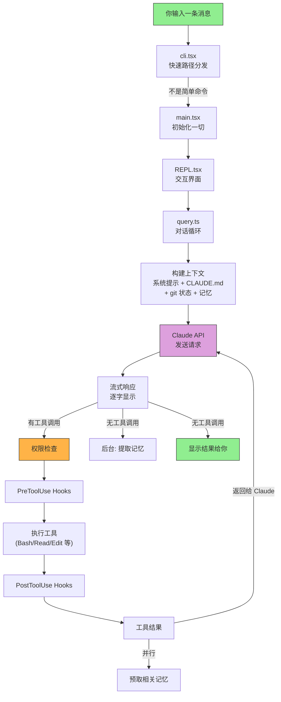

这张图覆盖了本书后续所有章节的核心模块。每个方框在后面都会用一整章来详细展开。

---

# 🚀 第二部分: 启动与运行

## 第 3 章: 一条命令背后发生了什么——启动流程

### 3.1 整体流程总览

当你在终端输入 `claude` 并回车，表面上只是启动了一个程序，但背后发生了一系列精心设计的步骤。整个过程分为**三站**:

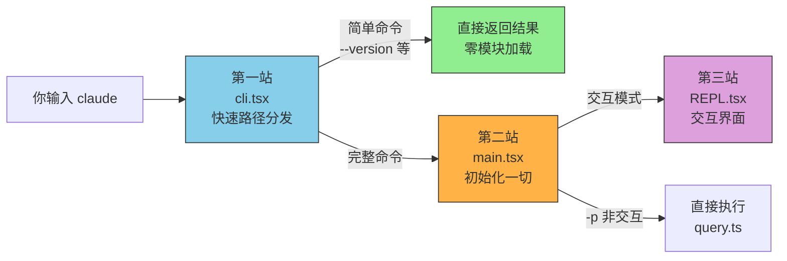

### 3.2 第一站: 快速路径分发 (cli.tsx, 302 行)

cli.tsx 是整个程序的**第一行代码**。它的设计哲学是: **能快速返回的就不要加载主模块**。

为什么？因为 `main.tsx` 有 4,685 行，导入它需要加载大量依赖。如果你只是想查版本号，等它全部加载完是浪费。

**cli.tsx 做的第一件事: 设置环境**

```typescript
// 阻止 corepack 自动修改 package.json
process.env.COREPACK_ENABLE_AUTO_PIN = '0'

// CCR 容器中设置堆大小 (16GB 容器分配 8GB 给 Node)
if (process.env.CLAUDE_CODE_REMOTE === 'true') {
  process.env.NODE_OPTIONS = '--max-old-space-size=8192'
}
```

**然后是 Ablation Baseline 检查**（科学实验的"对照组"）:

如果设置了 `CLAUDE_CODE_ABLATION_BASELINE` 环境变量，系统会一口气禁用**所有高级功能**:

```
CLAUDE_CODE_SIMPLE=1             → 只保留 Bash + Read + Edit 三个工具
CLAUDE_CODE_DISABLE_THINKING=1   → 禁用思考能力
DISABLE_INTERLEAVED_THINKING=1   → 禁用交错思考
DISABLE_COMPACT=1                → 禁用手动压缩
DISABLE_AUTO_COMPACT=1           → 禁用自动压缩
CLAUDE_CODE_DISABLE_AUTO_MEMORY=1 → 禁用自动记忆
DISABLE_BACKGROUND_TASKS=1       → 禁用后台任务
```

这是 Anthropic 工程师量化每个功能贡献的方式——关掉所有"增强"后测一个基准线，就知道这些功能加起来到底值多少。

**接下来是快速路径分发**: cli.tsx 逐个检查命令行参数，每匹配一个就通过 `await import()` **动态导入**对应的模块:

| 参数 | 导入什么 | 做什么 |
|------|---------|--------|
| `--version` / `-v` | 什么都不导入 | 直接输出 `MACRO.VERSION`，结束 |
| `--dump-system-prompt` | `config.js` + `prompts.js` | 输出渲染后的系统提示，结束 |
| `--claude-in-chrome-mcp` | `claudeInChrome/mcpServer.js` | 启动 Chrome MCP 服务器 |
| `--daemon-worker` | `daemon/workerRegistry.js` | 启动守护进程工作线程 |
| `remote-control` / `rc` | `bridge/bridgeMain.js` | 远程控制模式 |
| `daemon` | `daemon/main.js` | 守护进程管理 |
| `ps` / `logs` / `attach` / `kill` | `cli/bg.js` | 后台会话管理 |
| `new` / `list` / `reply` | `cli/handlers/templateJobs.js` | 模板任务 |
| `environment-runner` | `environment-runner/main.js` | BYOC 无头运行器 |
| `self-hosted-runner` | `self-hosted-runner/main.js` | 自托管运行器 |
| 都不匹配 | `main.js` | 加载完整 CLI |

**`--version` 为什么能做到零延迟？**

```typescript
// cli.tsx 第 37-42 行
if (args.length === 1 && (args[0] === '--version' || args[0] === '-v')) {
  console.log(`${MACRO.VERSION} (Claude Code)`)
  return  // 直接返回，没有任何 import
}
```

`MACRO.VERSION` 是一个编译时注入的常量（由 `bunfig.toml` 的 `[bundle.define]` 定义），不需要任何运行时计算。这就是为什么 `claude --version` 几乎瞬间返回。

**feature() 门控: 编译时删除不需要的路径**

很多快速路径被 `feature()` 包裹:

```typescript
if (feature('DAEMON') && args[0] === 'daemon') { ... }
if (feature('BRIDGE_MODE') && args[0] === 'remote-control') { ... }
```

在非 DAEMON 构建中，整个 `if` 块（包括 `await import('daemon/main.js')`）会被 Bun bundler **完全删除**。最终的构建产物根本不包含这些代码。

### 3.3 第二站: 主仓库初始化 (main.tsx, 4,685 行)

当没有匹配任何快速路径时，cli.tsx 的最后一步是:

```typescript
const { main: cliMain } = await import('../main.js')
await cliMain()
```

main.tsx 是整个应用的**大管家**。它按照精确的顺序初始化所有子系统:

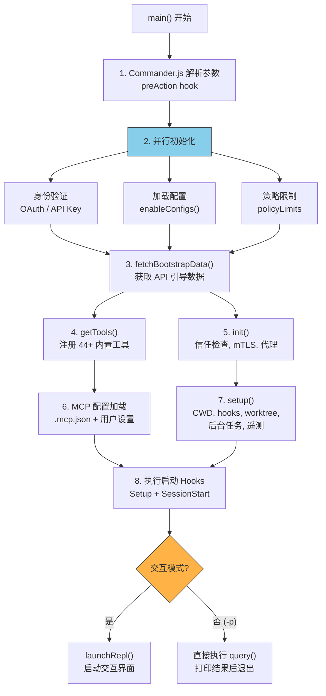

**步骤 2 为什么要并行初始化？** 因为身份验证要访问 Keychain（macOS 上可能需要几百毫秒），策略限制要请求远程服务器。如果串行做，用户会等很久。并行启动让它们**同时进行**，总耗时等于最慢的那一个而不是所有的总和。

**步骤 7 setup() 的详细内容** (源码: `src/setup.ts`, 477 行):

```
1. 检查 Node.js 版本 (要求 >= 18)
2. 设置自定义 session ID (如果提供了)
3. 启动 UDS 消息服务器 (用于团队成员通信)
4. 捕获队友模式快照 (swarms 相关)
5. 恢复终端备份 (iTerm2/Apple Terminal)
6. 设置 CWD + 解析 git root + Hook 配置快照
7. 创建 Git Worktree (如果 --worktree 标志)
8. 启动后台任务 (session memory, file watcher)
9. 预取命令/插件/输出样式
10. 连接遥测 sink
11. 预取 API 密钥
12. 检查发布说明
13. 验证权限配置
```

### 3.4 第三站: 交互界面 (REPL.tsx, 5,005 行)

如果是交互模式，main.tsx 调用 `launchRepl()` 启动 React Ink 界面:

```typescript
// replLauncher.tsx
export async function launchRepl(root, appProps, replProps, renderAndRun) {
  // 渲染 App 组件，包裹 REPL 屏幕
  // App 提供全局 Context（主题、权限、MCP 状态等）
  // REPL 管理用户输入、消息渲染、query 调用
}
```

REPL 屏幕是整个交互的核心。它做的事:
- 渲染用户输入框 (PromptInput 组件)
- 显示消息列表 (Messages 组件)
- 监听键盘输入 (通过 Keybindings 系统)
- 用户提交消息时调用 `onQuery()` → 进入 query.ts 对话循环
- 流式渲染 Claude 的回复
- 管理成本追踪、token 预算、模型选择

---

## 第 4 章: 对话的心脏——核心会话循环

### 4.1 为什么需要一个"循环"？

你可能会想: "用户问一个问题，Claude 回答，不就完了吗？为什么需要循环？"

因为 Claude 不只是"回答"——它经常需要**先调查再回答**。一个简单的 "帮我修 bug" 可能需要:
1. 搜索相关文件 → 拿到结果
2. 读取具体文件 → 拿到内容
3. 修改文件 → 确认修改成功
4. 运行测试 → 拿到测试结果
5. **最后才回答你**

每一步 Claude 都要"思考→决定下一步→执行→看结果→再思考"。这就是一个循环。

### 4.2 循环的完整结构

文件: `src/query.ts` (1,729 行)

query.ts 的核心是一个 `while(true)` 异步生成器。我们把它拆解成 5 个阶段:

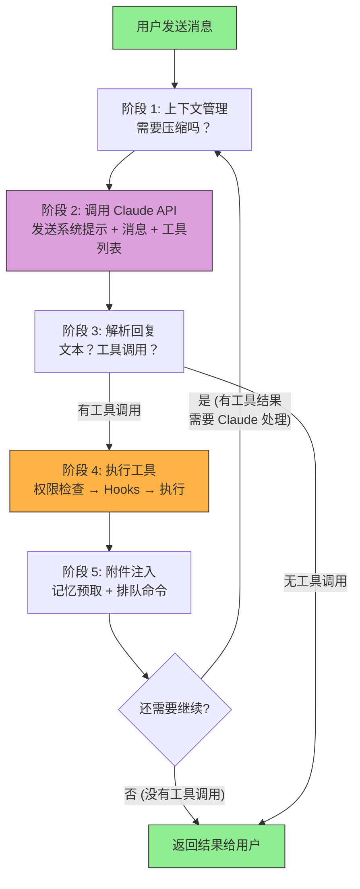

#### 阶段 1: 上下文管理

每次循环开始前，系统检查: "当前对话是不是太长了？"

如果接近上下文窗口限制，会触发压缩（详见第 17 章）。压缩后，消息列表变短，Claude 看到的历史更精简。

#### 阶段 2: 调用 Claude API

系统把以下信息打包发给 Claude:

```
[系统提示词]
  "你是 Claude Code，一个编程助手..."
  + 工具使用指南
  + 记忆系统指南
  + 各工具的 prompt 段落

[上下文]
  + CLAUDE.md 文件内容
  + 当前日期
  + git 状态（分支、最近提交）
  + MEMORY.md 索引

[对话历史]
  所有之前的消息（用户 + Claude + 工具结果）

[工具定义]
  44 个内置工具 + MCP 工具的 JSON Schema
```

这里有一个**系统提示的缓存分界线**设计: 系统提示被分为"静态"和"动态"两部分（用 `SYSTEM_PROMPT_DYNAMIC_BOUNDARY` 标记分隔）。静态部分（身份介绍、工具指南等）对所有用户一样，可以被 API 端全局缓存，节省约 90% 的 token 成本。动态部分（git 状态、日期、CLAUDE.md）每个用户不同，不缓存。

#### 阶段 3: 解析回复

Claude API 的回复是**流式**的——不是一口气全部返回，而是像打字一样一个字一个字出来:

```
message_start     → 开始
content_block_start(text) → 文本块开始
content_delta     → "我"
content_delta     → "来看看"
content_delta     → "这个文件"
content_block_stop → 文本块结束
content_block_start(tool_use) → 工具调用块开始
content_delta     → {"name":"Read","input":{"file_path":"src/auth.ts"}}
content_block_stop → 工具调用块结束
message_stop      → 全部结束
```

你在终端看到文字逐字出现就是这个原因。

**空闲超时看门狗**: 如果流中超过 `STREAM_IDLE_TIMEOUT_MS`（默认 90 秒）没有新数据，系统判定连接卡住了:
- 超时一半时 → 打印警告
- 完全超时 → 中断流，尝试用非流式方式重新请求

#### 阶段 4: 执行工具

当 Claude 的回复中包含 `tool_use` 块时，系统进入工具执行流程（详见第 6 章）。这里有两个关键设计:

**并发分组**: 多个只读工具可以同时执行:

```
Claude 一次性请求了 3 个工具:
  1. Read("a.ts")     ← 只读
  2. Read("b.ts")     ← 只读
  3. Edit("c.ts")     ← 写入

执行计划:
  [并发] Read(a.ts) + Read(b.ts)  → 同时执行
  [串行] Edit(c.ts)               → 等上面完成后再执行
```

**权限检查**: 每个工具执行前都要经过权限管道（详见第 7 章）。

#### 阶段 5: 附件注入

工具执行完后，在把结果返回给 Claude 之前，系统还会:
- **注入相关记忆**: 预取的记忆文件（如果准备好了）
- **注入排队命令**: 用户在 Claude 思考时输入的新消息
- **注入 Skill 发现**: 可用的 Skill 信息

### 4.3 循环什么时候结束？

| 条件 | 结果 | 例子 |
|------|------|------|
| Claude 回复中没有 tool_use | 正常结束 | Claude 直接回答了问题 |
| API 返回错误 | 错误终止 | 认证失败、prompt 太长 |
| 用户按 Ctrl+C | 中断 | 不想等了 |
| 达到最大轮次 | 轮次限制 | 防止无限循环 |
| Stop Hook 阻止 | Hook 终止 | 自定义逻辑判定应该停止 |

### 4.4 系统提示: Claude 的"工作手册"

文件: `src/constants/prompts.ts` (914 行)

Claude 每次被调用时，都会收到一份长长的"工作手册"（系统提示）。这份手册告诉它:

```
1. 你是谁: "你是 Claude Code，Anthropic 的官方 CLI"
2. 怎么用工具: "用 Read 而不是 cat，用 Edit 而不是 sed"
3. 怎么做任务: "先理解代码再修改，不要加不必要的注释"
4. 安全规范: "不要引入 XSS、SQL 注入等安全漏洞"
5. 输出风格: "简洁直接，不要废话"
6. 每个工具的详细使用说明
```

**提示的优先级系统** (源码: `src/utils/systemPrompt.ts`):

| 优先级 | 来源 | 什么时候用 |
|--------|------|-----------|
| 1 (最高) | Override Prompt | 完全替换默认提示 |
| 2 | Coordinator Prompt | 协调器模式 |
| 3 | Agent Prompt | 自定义 Agent 定义 |
| 4 | Custom Prompt (`--system-prompt`) | 用户指定 |
| 5 | Default Prompt | 标准 Claude Code 提示 |
| +追加 | Append Prompt | 始终追加在末尾 |

**缓存段落管理** (源码: `src/constants/systemPromptSections.ts`):

每个提示段落可以标记为"可缓存"或"每轮重算":
- `systemPromptSection('memory', ...)` → 缓存，每会话只计算一次
- `DANGEROUS_uncachedSystemPromptSection(...)` → 每轮重算，会破坏 prompt cache

### 4.5 两种 State: 进程级 vs React 级

Claude Code 有两套状态管理，很多人会混淆它们。

#### bootstrap/state.ts (1,758 行) — 进程级全局状态

这是一个**模块级单例**，在 React 渲染之前就存在。

```
const STATE: State = getInitialState()  // 启动时创建，全局唯一
```

文件顶部有警告: `// DO NOT ADD MORE STATE HERE - BE JUDICIOUS WITH GLOBAL STATE`

它存储**不依赖 React 的信息**:

| 类别 | 字段 | 说明 |
|------|------|------|
| 会话身份 | `sessionId`, `parentSessionId` | 当前会话 UUID 和血缘关系 |
| 路径 | `originalCwd`, `projectRoot`, `cwd` | 项目根 vs 工作目录 |
| 成本 | `totalCostUSD`, `modelUsage` | API 费用追踪 |
| 性能 | `totalAPIDuration`, `totalToolDuration` | 累计耗时 |
| 模型 | `mainLoopModelOverride` | 模型选择 |
| 遥测 | `meter`, `loggerProvider`, `tracerProvider` | OpenTelemetry |
| 权限 | `sessionBypassPermissionsMode` | 会话级权限 |
| Hook | `registeredHooks` | 已注册的 Hook 映射 |
| 缓存 | `afkModeHeaderLatched`, `fastModeHeaderLatched` | 粘性开关，防止 prompt cache 失效 |

**所有访问都通过函数**，不直接暴露 STATE 对象:

```typescript
export function getSessionId(): SessionId { return STATE.sessionId }
export function getTotalCostUSD(): number { return STATE.totalCostUSD }
export function setCwdState(cwd: string): void { STATE.cwd = cwd.normalize('NFC') }
```

注意最后一行: **所有路径都做 `.normalize('NFC')` 处理**。这是因为 macOS 的 HFS+ 文件系统对 Unicode 有独特的分解方式，如果不统一规范化，同一个文件名可能有不同的字节表示，导致路径比较失败。

#### state/AppStateStore.ts — React UI 层状态

这是给 React 组件用的状态，通过 `Store<T>` + `subscribe()` 模式管理。

它存储**和 UI 渲染相关的信息**:

```
UI 状态: settings, expandedView, selectedIPAgentIndex
Bridge 状态: replBridgeEnabled, replBridgeSessionUrl
任务管理: tasks map, foregroundedTaskId
MCP/插件: clients, tools, commands, resources, errors
Agent 定义: agentDefinitions, fileHistory
```

**两者的关系**: `bootstrap/state.ts` 是"大脑"（启动时就需要，不依赖 React），`AppStateStore.ts` 是"表情"（驱动 UI 渲染，React 生命周期内）。

### 4.6 会话管理: 切换、恢复、持久化

**会话切换的原子性**:

当你 `claude --resume` 恢复一个旧会话时，系统调用:

```typescript
export function switchSession(sessionId, projectDir = null): void {
  STATE.planSlugCache.delete(STATE.sessionId)  // 清理旧缓存
  STATE.sessionId = sessionId                   // 切换 ID
  STATE.sessionProjectDir = projectDir          // 切换项目目录
  sessionSwitched.emit(sessionId)               // 通知订阅者
}
```

`sessionId` 和 `sessionProjectDir` **必须同时更新**——没有单独设置其中一个的函数。这是有意设计，防止状态不一致（比如 ID 换了但还在读旧项目的转录文件）。

**会话转录持久化**:

每次对话都记录在 JSONL 文件中:

```
~/.claude/projects/<project>/.sessions/<session-id>.jsonl
```

每行是一个 JSON 对象，记录了消息内容、工具调用、成本等。恢复会话时就是读取这个文件重建对话历史。

**历史记录**:

```
~/.claude/history.jsonl
```

每次你输入一条消息，都会追加到这个全局历史文件。`Ctrl+R` 搜索历史就是读取这个文件。小于 1KB 的粘贴内容内联存储，大于 1KB 的通过哈希引用外部文件。

---

# 🔧 第三部分: 工具与能力

## 第 6 章: Claude 的工具箱——工具系统

### 6.1 为什么需要"工具"？

Claude 的大脑（AI 模型）只能**生成文字**。它不能直接读磁盘上的文件、不能执行 Shell 命令、不能访问网络。它能做的只是: "我想读 auth.ts 的内容"——然后**工具系统**帮它真正去读。

**日常比喻**: Claude 的大脑是大脑，工具系统是它的手脚。大脑想"拿起杯子"，手去执行。没有手，再聪明的大脑也只能空想。

### 6.2 工具一览

每个工具就像瑞士军刀上的一个功能:

| 工具 | 做什么 | 日常比喻 |
|------|-------|---------|
| Bash | 执行 shell 命令 | 万能遥控器 |
| Read | 读取文件内容 | 放大镜 |
| Edit | 精确修改文件 | 手术刀 |
| Write | 创建新文件 | 打印机 |
| Glob | 按模式查找文件 | 文件检索系统 |
| Grep | 在文件内容中搜索 | 全文搜索引擎 |
| Agent | 派出子 Agent 执行任务 | 派助手去做事 |
| WebSearch | 搜索互联网 | 浏览器搜索框 |
| WebFetch | 获取网页内容 | 下载器 |

### 一个工具长什么样？

每个工具都要回答这些问题：

```
1. 你叫什么？  → name: "Bash"
2. 你能做什么？ → description(): "执行 shell 命令"
3. 你需要什么输入？ → inputSchema: { command: string, timeout?: number }
4. 你是只读的吗？ → isReadOnly(): 看具体命令
5. 可以并发吗？ → isConcurrencySafe(): 看具体命令
6. 你危险吗？ → isDestructive(): 看具体命令
```

**具体例子——Bash 工具的安全判断**:

```
Bash("git status")   → isReadOnly: true, isConcurrencySafe: true
Bash("rm -rf /")     → isReadOnly: false, isDestructive: true
Bash("npm install")  → isReadOnly: false, isConcurrencySafe: false
```

### 工具如何被执行？一个完整的流程

假设 Claude 决定要执行 `Bash("npm test")`：

```
Claude 说: "我要运行测试"
    + tool_use: Bash({command: "npm test"})
           |
           v
    [第 1 步: 输入验证]
    "npm test" 是有效的 Bash 命令吗？ → 是
           |
    [第 2 步: Pre-Tool Hook]
    有没有用户自定义的"执行前检查"？
    比如用户设置了"所有 npm 命令需要确认" → 执行那个检查
           |
    [第 3 步: 权限检查]
    这个命令允许执行吗？
    +-- 检查 allow/deny 规则
    +-- 如果是 auto 模式 → AI 安全分类器判断
    +-- 如果需要确认 → 弹出提示问用户
           |
    [第 4 步: 执行]
    实际运行 npm test，流式传输输出
           |
    [第 5 步: Post-Tool Hook]
    有没有"执行后处理"？比如记录审计日志
           |
    [第 6 步: 结果处理]
    输出太长？截断。超过 100KB？保存到磁盘，给 Claude 一个摘要。
```

### 并发执行: 又快又安全

当 Claude 一次调用多个工具时（比如同时读 3 个文件），系统不会一个一个地执行，而是**智能分组**：

```
Claude 的请求:
  1. Read("src/a.ts")      ← 只读
  2. Read("src/b.ts")      ← 只读
  3. Grep("function login") ← 只读
  4. Edit("src/c.ts")      ← 写入

执行计划:
  [并发批次 1] Read(a.ts) + Read(b.ts) + Grep(login) → 同时执行
  [串行批次 2] Edit(c.ts) → 等前面完成后单独执行
```

**为什么？** 多个读操作不会互相干扰，可以并行加速。但写操作可能受前面读取结果的影响，必须等前面完成。

### 延迟加载: 不用的工具不占空间

Claude Code 有 44+ 个内置工具加上不定数量的 MCP 外部工具。如果把所有工具的完整定义都发给 Claude API，会占用大量 token（≈花更多钱）。

解决方案是**延迟加载**：

```
系统提示中只告诉 Claude: "你还有这些工具可用: NotebookEdit, LSP, ListMcpResources..."
                                        （只有名字，没有详细用法）

当 Claude 需要用其中一个时:
  Claude: ToolSearch("NotebookEdit")
  系统: [返回 NotebookEdit 的完整定义和使用方法]
  Claude: 现在我知道怎么用了！NotebookEdit({...})
```

就像餐厅的菜单——你先看菜名列表，感兴趣时再要详细介绍。

### 6.7 工具的注册: 谁决定哪些工具可用？

文件: `src/tools.ts` (389 行)

不是所有工具都始终可用。工具注册经过**三层过滤**:

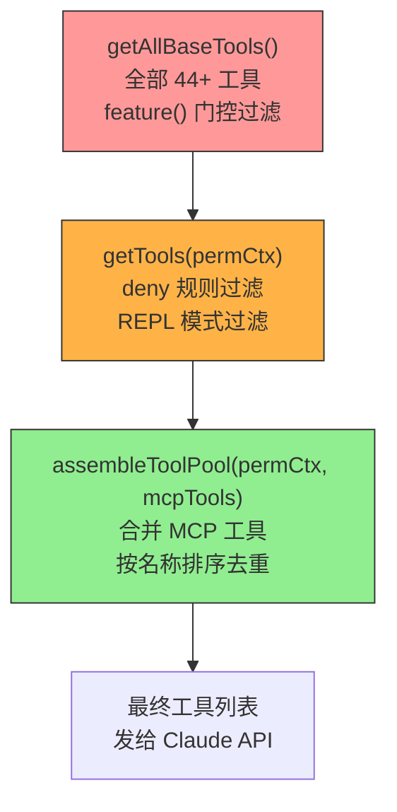

**第 1 层: feature() 门控** — 编译时就决定了哪些工具存在

```
Sleep 工具 → 只在 feature('PROACTIVE') || feature('KAIROS') 时存在
Cron 工具 → 只在 feature('AGENT_TRIGGERS') 时存在
REPL 工具 → 只在 process.env.USER_TYPE === 'ant' 时存在
```

**第 2 层: deny 规则** — 用户配置决定哪些工具被禁用

如果你在 settings.json 中配置了 `deny` 规则（比如 `"deny": ["Bash(rm *)"]`），对应的工具在发给 Claude 之前就被过滤掉了——Claude 甚至不知道这个工具存在。

**第 3 层: MCP 工具合并** — 外部工具和内置工具统一

MCP 工具和内置工具合并时有一个重要的排序策略: **内置工具按名称排序后作为前缀，MCP 工具排序后追加在后面**。这确保增减 MCP 工具不会打乱内置工具的顺序，从而**不破坏 prompt cache**（缓存按前缀匹配，前缀不变就不失效）。

### 6.8 不同角色的工具限制

不同"身份"的 Claude 能用的工具不同:

| 角色 | 可用工具 | 不可用工具 | 源码常量 |
|------|---------|-----------|---------|
| **主 Claude** | 全部 44+ | 无限制 | — |
| **子 Agent** | 大部分 | Agent (防递归), TaskOutput, ExitPlanMode | `ALL_AGENT_DISALLOWED_TOOLS` |
| **异步子 Agent** | Read, Bash, Web*, Grep, Edit, Write, Skill | 大部分其他工具 | `ASYNC_AGENT_ALLOWED_TOOLS` |
| **进程内队友** | 异步 Agent 工具 + Task*, SendMessage, Cron | Agent (防递归) | `IN_PROCESS_TEAMMATE_ALLOWED_TOOLS` |
| **Coordinator 工作者** | Output, Agent, SendMessage | 所有其他 | `COORDINATOR_MODE_ALLOWED_TOOLS` |

**为什么子 Agent 不能用 Agent 工具？** 防止无限递归——Agent 1 派出 Agent 2，Agent 2 又派 Agent 3... 永无止境。

### 6.9 工具结果太大怎么办？

一个 `Bash("find / -name '*.ts'")` 可能返回几万行输出。如果把所有内容都发给 Claude API，会消耗大量 token。

源码中 `src/utils/toolResultStorage.ts` 定义了每种工具的最大结果大小:

| 工具 | 最大结果 | 超限时怎么办 |
|------|---------|-------------|
| Bash | 100KB | 保存到磁盘，给 Claude 文件引用 + 前后预览 |
| Read | 无限 | 永不截断（否则 Claude 看到的代码不完整） |
| Grep/Glob | 100KB | 同 Bash |
| MCP 工具 | 100KB | 同 Bash |

**"保存到磁盘 + 文件引用"是什么意思？**

```
原始: Bash("npm test") 返回 200KB 测试输出

截断后给 Claude 的:
  "结果已保存到 /tmp/.claude/tool-results/abc123.txt
   预览 (前 1000 字符): PASS src/auth.test.ts...
   ...
   预览 (后 1000 字符): ...Tests: 142 passed, 3 failed"
```

Claude 看到前后各 1000 字符的预览，如果需要更多细节可以用 Read 工具去读完整文件。

---

## 第 7 章: 安全卫士——权限系统

### 7.1 为什么需要权限？

Claude 能执行 shell 命令、修改文件、访问网络。如果没有任何限制，一个错误的判断可能导致灾难。

**一个真实的风险场景**: Claude 分析日志时发现一个临时文件，决定"清理一下"运行了 `rm -rf /tmp/project-cache`。但这个目录恰好是另一个构建进程的缓存——几小时的构建成果没了。

权限系统就像**多层安检站**，确保 Claude 的每个操作都是安全的。

### 7.2 权限检查的完整管道

文件: `src/utils/permissions/permissions.ts` (1,486 行)

每次 Claude 要调用工具时，都会经过这个管道:

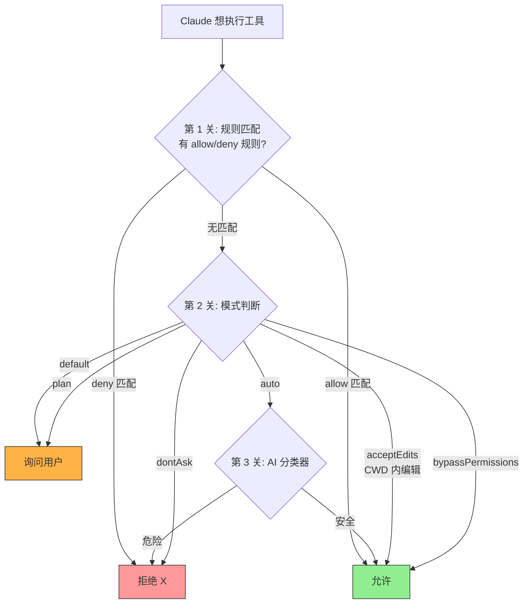

**规则格式**: `ToolName(pattern)` — 例如 `Bash(git *)` 匹配所有 git 开头的命令，`Write(src/**/*.ts)` 匹配 src 目录下所有 TypeScript 文件的写入。

**规则来源** (优先级从高到低): policySettings (组织策略) > projectSettings (项目) > localSettings (本地) > userSettings (用户) > cliArg (命令行) > session (会话)

**每个决策都有审计追踪**: 系统记录了每次 allow/deny 的原因——是匹配了哪条规则、哪个模式判断的、还是 AI 分类器的决定。

### 7.3 六种安全模式

Claude Code 提供 6 种"安全等级"，你可以根据信任程度选择：

| 模式 | 比喻 | 行为 |
|------|------|------|
| `default` | 机场安检 | 危险操作要人工确认 |
| `plan` | 纸上谈兵 | 所有操作都只能看不能做，需确认 |
| `acceptEdits` | 信任的同事 | 文件编辑自动允许，其他操作照常检查 |
| `auto` | AI 安保 | AI 分类器自动判断是否安全 |
| `bypassPermissions` | 无限信任 | 什么都允许（危险！） |
| `dontAsk` | 严格禁止 | 没有规则允许的操作全部拒绝 |

### 一个权限检查的完整故事

假设你在 `default` 模式下，Claude 要执行 `rm -rf node_modules`：

```
[第 1 关: 规则匹配]
系统检查你配置的规则:
  - 允许规则: Bash(git *), Bash(npm test)  → 不匹配
  - 拒绝规则: Bash(rm -rf *)              → 匹配！
→ 结果: 直接拒绝，告诉 Claude "这个命令被规则禁止了"

如果没有匹配的规则:

[第 2 关: 模式判断]
当前是 default 模式 → 需要询问用户

[第 3 关: 用户确认]
终端显示:
  "Claude 想要执行: rm -rf node_modules
   [允许] [拒绝] [创建允许规则]"
   
你选择"允许" → 执行
你选择"拒绝" → Claude 收到拒绝消息，换个方式处理
```

### Auto 模式的 AI 安保

Auto 模式使用了一个**两阶段 AI 分类器**来自动判断操作是否安全：

```
第 1 阶段 (快速判断):
  "npm test" → 明显安全 → 允许（不需要第 2 阶段）
  "rm -rf /" → 明显危险 → 拒绝

第 2 阶段 (深入分析):
  "curl api.example.com | bash" → 需要仔细想想...
  → 分析对话上下文、用户的 CLAUDE.md 配置
  → 得出结论: 拒绝（从网络下载并执行脚本太危险）
```

有些工具被列入"安全白名单"，直接跳过分类器：
- Read、Glob、Grep（只读操作）
- TaskCreate、TaskUpdate（任务管理）
- AskUserQuestion（问用户问题）

---

## 第 8 章: 可编程的拦截器——Hook 系统

### 什么是 Hook？

Hook（钩子）是一种"事件拦截器"。你可以在 Claude Code 的生命周期中插入自定义逻辑。

**日常比喻**: Hook 就像快递柜的取件通知——每次有包裹到了（事件发生了），你都会收到一条消息，然后决定怎么处理。

### 19+ 种事件

Claude Code 在很多时刻都会"广播"事件：

```
"我要启动了"              → Setup
"会话开始了"              → SessionStart
"要执行一个工具了"         → PreToolUse     ← 最常用
"工具执行完了"             → PostToolUse
"用户提交了输入"           → UserPromptSubmit
"要结束回复了"             → Stop
"会话要压缩了"             → PreCompact / PostCompact
"配置文件变了"             → ConfigChange
...
```

### 四种 Hook 类型

你可以用四种方式响应这些事件：

**1. Shell 命令 Hook** (最常用)

```json
{
  "hooks": {
    "PreToolUse": [{
      "matcher": "Bash",
      "hooks": [{
        "type": "command",
        "command": "./scripts/check-safety.sh"
      }]
    }]
  }
}
```

每次 Claude 要执行 Bash 命令前，先运行你的检查脚本。脚本通过 stdin 收到 JSON 格式的工具信息，通过 stdout 返回 JSON 格式的决策。

**具体例子**: 你想在每次 git push 前检查是否推到了正确的分支：

```bash
#!/bin/bash
# check-safety.sh
INPUT=$(cat)  # 从 stdin 读取 JSON
COMMAND=$(echo "$INPUT" | jq -r '.tool_input.command')

if echo "$COMMAND" | grep -q "git push.*main"; then
  echo '{"decision": "block", "reason": "禁止直接推送到 main 分支！"}'
else
  echo '{}'  # 空 JSON = 允许
fi
```

**2. HTTP Hook** (发送到外部服务)

```json
{
  "type": "http",
  "url": "https://audit.yourcompany.com/log",
  "timeout": 5,
  "async": true
}
```

每次工具执行后，异步发送审计日志到公司的日志服务。

**3. AI 提示 Hook** (用 AI 来判断)

```json
{
  "type": "prompt",
  "prompt": "检查这个操作是否符合公司的代码规范。如果不符合，返回 {ok: false, reason: '原因'}",
  "model": "haiku"
}
```

用一个小模型（Haiku，更便宜）来做自动化审查。

**4. Agent Hook** (完整的 AI 验证)

```json
{
  "type": "agent",
  "prompt": "仔细验证这个文件修改是否引入了安全漏洞",
  "timeout": 60
}
```

启动一个完整的 Agent 会话来做深度检查（比如安全审计）。

### 8.5 Hook 的执行流程

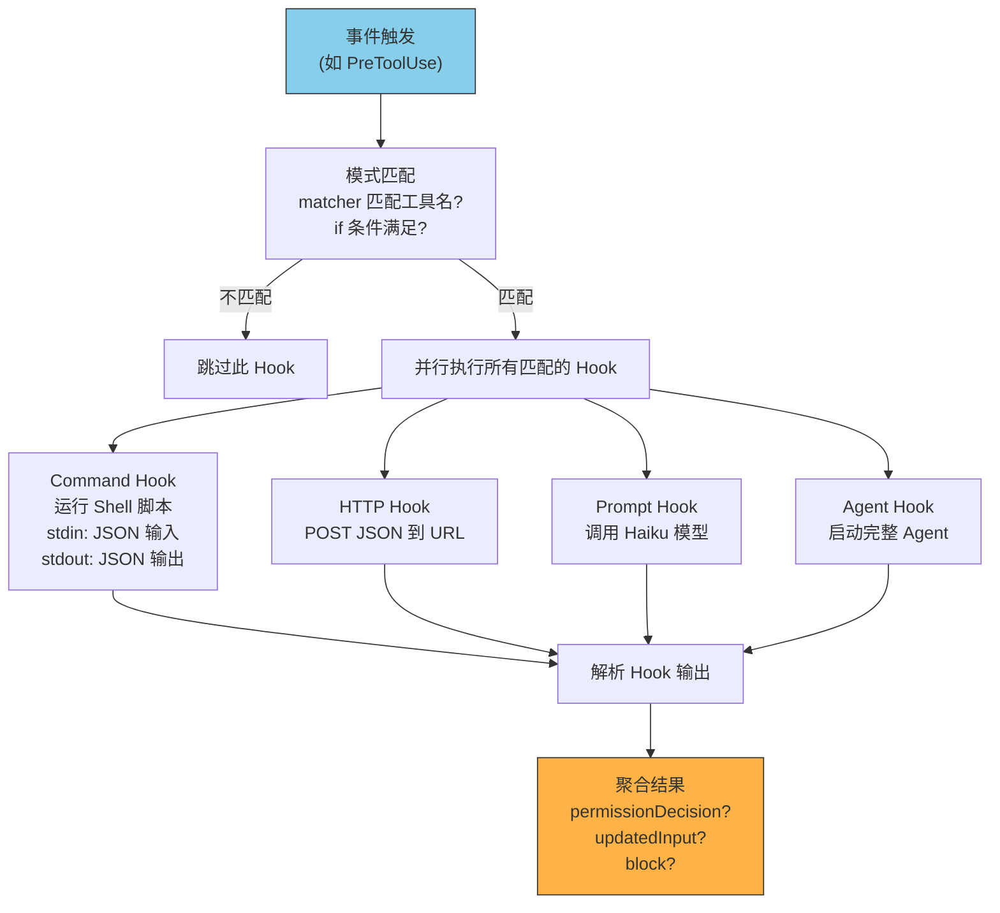

**`if` 条件过滤**: Hook 可以用权限规则语法来精确限定"只对特定操作触发":

```json
{
  "matcher": "Bash",
  "hooks": [{
    "type": "command",
    "command": "./check-destructive.sh",
    "if": "Bash(rm *)"
  }]
}
```

这个 Hook 只在 Bash 工具执行 `rm` 开头的命令时触发——普通的 `git status` 不会触发它。

### 8.6 Hook 能做什么？

Hook 的输出可以**改变 Claude 的行为**:

| 输出字段 | 效果 | 例子 |
|---------|------|------|
| `{decision: "block"}` | 阻止工具执行 | 拒绝删除文件的操作 |
| `{permissionDecision: "allow"}` | 自动批准 (跳过用户确认) | 公司安全审查通过后自动放行 |
| `{permissionDecision: "deny"}` | 自动拒绝 | 外部安全服务判定为危险 |
| `{updatedInput: {...}}` | 修改工具输入 | 自动给 Bash 命令加 `set -e` |
| `{additionalContext: "..."}` | 给 Claude 额外信息 | "注意: 这个文件上次修改导致了 bug" |

**async 模式**: Hook 可以设为 `"async": true`，这意味着它在后台运行，**不阻塞工具执行**。适合审计日志等不需要即时结果的场景。

**once 模式**: 设为 `"once": true`，Hook 只运行一次后自动注销。适合一次性检查。

### 8.7 Hook 与权限系统的协作

Hook 和权限系统不是独立的——它们协同工作:

```
1. PreToolUse Hook 先执行
   → Hook 可以返回 permissionDecision (allow/deny)
   → 如果返回了，直接用这个决策，跳过后续的规则检查和模式判断

2. 如果 Hook 没有提供 permissionDecision
   → 正常执行权限管道（规则匹配 → 模式判断 → AI 分类器）

3. 如果权限管道决定 "ask"
   → PermissionRequest Hook 触发
   → Hook 可以修改提示内容或自动做出决策

4. 工具执行后
   → PostToolUse Hook 触发
   → 可以修改输出或追加上下文
```

这意味着你可以用 Hook 实现**完全自定义的权限策略**——比如连接公司内部的安全审查系统，让它来决定每个操作是否被允许。

---

# 🤖 第四部分: 多智能体协作

## 第 9 章: 分身术——Agent 子智能体

### 9.1 为什么需要"分身"？

有些任务太大了，一个 Claude 从头到尾做太慢。想象你是一个项目经理，可以把任务分配给团队成员:

```
用户: "帮我重构 auth 模块，同时给新的 API 端点写测试"

Claude (主体): "好的，我来分工..."
  |
  +-- 派出 Agent 1 (Explore 类型): "去调查 auth 模块的结构"
  |
  +-- 派出 Agent 2 (general-purpose): "去写 API 端点的测试"
  |
  +-- 自己: 等两个 Agent 完成后，综合它们的发现，做最终的重构
```

### 9.2 六种内置 Agent 类型

源码位置: `src/tools/AgentTool/built-in/`，每种 Agent 有自己的定义文件。

| 类型 | 擅长什么 | 比喻 | 默认模型 |
|------|---------|------|---------|
| `general-purpose` | 什么都能做 | 全能助手 | 和主体一样 |
| `Explore` | 快速搜索和阅读代码（只读） | 侦察兵 | Haiku (快) |
| `Plan` | 设计方案和架构 | 架构师 | 和主体一样 |
| `Verification` | 验证和测试 | 质检员 | 和主体一样 |
| `claude-code-guide` | 回答 Claude Code 使用问题 | 客服 | 和主体一样 |
| `statusline-setup` | 配置状态栏 | UI 设计师 | 和主体一样 |

### 9.3 一个 Agent 从生到死的完整过程

文件: `src/tools/AgentTool/runAgent.ts` (973 行)

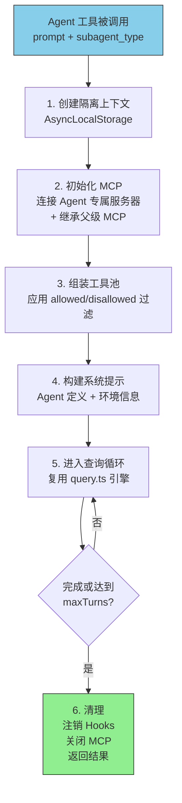

**模型继承机制** (源码: `src/utils/model/agent.ts`):

子 Agent 用什么模型？优先级从高到低:
1. 环境变量 `CLAUDE_CODE_SUBAGENT_MODEL`
2. Agent 工具调用时指定的 `model` 参数
3. Agent 定义文件中的 `model` frontmatter
4. 默认: `'inherit'` → 和父级用同一个模型

这意味着你可以让 Explore Agent 用 Haiku（快但便宜），重要任务用 Opus（慢但强）。

### 9.4 Agent 的隔离: 不互相干扰

多个 Agent 同时运行时，它们的状态不能互相污染。这通过 Node.js 的 `AsyncLocalStorage` 实现——每个 Agent 有自己的"私人储物柜"，存放自己的身份信息：

```
Agent 1 的储物柜: { id: "agent-1", task: "调查 auth 模块" }
Agent 2 的储物柜: { id: "agent-2", task: "写 API 测试" }
```

即使它们在同一个进程中并发运行，也不会互相读到对方的信息。

### Worktree 隔离: 文件级别的分离

如果两个 Agent 都要修改文件，怎么避免冲突？ 答案是 Git Worktree——给每个 Agent 创建仓库的独立副本：

```
主仓库: /your-project/
Agent 1 的工作树: ~/.claude/worktrees/agent-1/  (独立的文件副本)
Agent 2 的工作树: ~/.claude/worktrees/agent-2/  (又一个独立副本)
```

Agent 完成后，它的修改可以被审查后合并回主仓库。就像 Git 分支，但是物理上隔离的目录。

---

## 第 10 章: 组建团队——Team/Swarm 系统

### 10.1 Agent vs Team: 根本区别

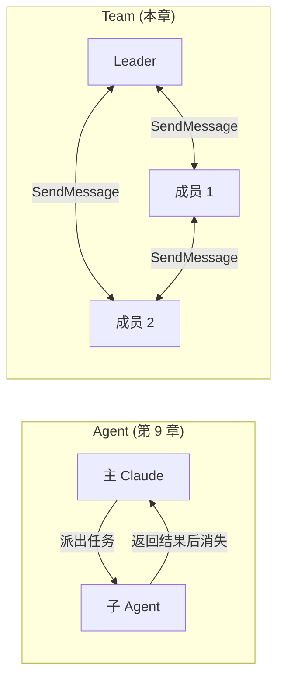

- **Agent**: 派出去做一件事，做完回来汇报，然后消失 → 像外卖骑手
- **Team**: 创建持久化团队，成员持续存在，互相通信 → 像你的同事

### 10.2 团队如何通信？文件邮箱系统

源码: `src/utils/teammateMailbox.ts` (1,183 行)

团队成员之间通过**文件邮箱**通信：

```
~/.claude/teams/my-team/inboxes/
  researcher.json   ← researcher 的收件箱
  coder.json        ← coder 的收件箱
  reviewer.json     ← reviewer 的收件箱
```

每个收件箱是一个 JSON 文件，里面是消息数组。当 researcher 要告诉 coder 什么，它用 SendMessage 工具往 coder.json 里写一条消息。

**为什么用文件而不用进程间通信？** 因为团队成员可能在不同的终端窗口中运行（通过 Tmux 或 iTerm2 分窗），文件是跨进程通信的最简单方式。

### 三种执行后端

| 后端 | 怎么运行 | 优点 | 缺点 |
|------|---------|------|------|
| In-Process | 同一个进程内 | 零开销，响应快 | 共享内存，需要 AsyncLocalStorage 隔离 |
| Tmux | 每个成员一个 Tmux 窗格 | 完全独立 | 需要安装 Tmux |
| iTerm2 | 每个成员一个 iTerm2 分割窗 | macOS 原生体验 | 仅限 macOS + iTerm2 |

---

## 第 11 章: 指挥官模式——Coordinator

### 11.1 和 Team 有什么不同？

Team 是"网状"的——成员之间可以互相通信。Coordinator 是"星型"的——只有一个指挥官在中心，工人们只和指挥官通信。

```
Team 模式:        Coordinator 模式:
  A <--> B           指挥官
  A <--> C          / | \
  B <--> C         工人 工人 工人
```

Coordinator 模式下，主 Claude 实例变成了一个**不写代码的项目经理**——它只负责分析需求、分配任务、综合结果。工人 Agent 负责实际的读写操作。

**具体例子**:

```
用户: "优化整个项目的性能"

Coordinator (指挥官):
  "先让两个侦察兵并行调查"
  +-- Agent("调查前端渲染性能", 后台运行)
  +-- Agent("调查 API 响应时间", 后台运行)
  
  [两个 Agent 完成后，Coordinator 收到任务通知]
  
  "综合两份报告...前端问题是组件重渲染，API 问题是 N+1 查询。
   按优先级串行处理:  
   1. 先修 API N+1 查询 (影响大)"
  +-- Agent("修复 UserService 的 N+1 查询, 文件 src/services/user.ts:89, 
             改 findAll 为 findAllWithJoin", 前台运行)
  
  [修复完成]
  
  "验证一下"
  +-- Agent("运行 API 性能测试", 后台运行)
```

关键原则: **指挥官必须先理解研究结果，再分配后续任务。永远不要写 "based on your findings, fix it"——必须明确指出具体要修改什么文件、哪一行、改成什么。**

---

# 🔌 第五部分: 扩展与连接

## 第 12 章: 万能插座——MCP 协议

### 什么是 MCP？

MCP (Model Context Protocol) 是一个开放协议，让 Claude Code 能连接任何外部工具服务器。

**比喻**: MCP 就像 USB 接口——不管你想连打印机、摄像头还是硬盘，只要它有 USB 口，就能即插即用。

### 一个 MCP 服务器长什么样？

你在项目根目录创建一个 `.mcp.json` 文件：

```json
{
  "mcpServers": {
    "github": {
      "type": "stdio",
      "command": "npx",
      "args": ["-y", "@modelcontextprotocol/server-github"],
      "env": { "GITHUB_TOKEN": "${GITHUB_TOKEN}" }
    }
  }
}
```

这告诉 Claude Code: "启动一个 GitHub MCP 服务器，用环境变量里的 token 认证。"

之后 Claude 就能使用 GitHub 相关的工具了：

```
Claude: 让我查看这个 PR 的评论
  + tool_use: mcp__github__list_pr_comments({repo: "owner/repo", pr: 42})
```

注意工具名称的前缀: `mcp__github__list_pr_comments` 。`mcp__` 前缀表示这是来自 MCP 服务器的工具，`github` 是服务器名，`list_pr_comments` 是具体工具。

### 七种传输方式

MCP 服务器可以通过不同方式连接：

| 方式 | 适用场景 | 比喻 |
|------|---------|------|
| stdio | 本地子进程（最常用） | 面对面交谈 |
| sse | Server-Sent Events | 听广播 |
| http | 流式 HTTP | 写信 |
| ws | WebSocket 双向通信 | 打电话 |
| sdk | 进程内 Agent SDK 调用 | 内部对讲机 |
| claudeai-proxy | Claude.ai 代理认证桥接 | 通过中介交谈 |
| ws-ide | IDE WebSocket 扩展协议 | 和编辑器通信 |

---

## 第 13 章: 技能与命令——Skill 系统

### Skill 就是可重用的提示词

当你发现自己总是给 Claude 说同样的话（"按照我们团队的规范提交代码"），就可以把它做成一个 Skill。

**创建一个 Skill**: 在 `.claude/skills/commit-style.md` 创建文件：

```markdown
---
description: "按团队规范提交代码"
user-invocable: true
allowed-tools: ["Bash(git *)"]
---

请按照以下规范创建 git commit:
1. 标题用英文，小写开头，不超过 50 字符
2. 标题格式: <type>: <description>，type 是 feat/fix/docs/refactor
3. 正文中文，解释"为什么"而不是"做了什么"

现在查看所有未提交的修改，创建一个符合规范的 commit。
```

使用时: 输入 `/commit-style`，Claude 就会按照这个规范执行。

### 两种执行方式

| 方式 | `context: "inline"` (默认) | `context: "fork"` |
|------|---------------------------|-------------------|
| 行为 | 把 Skill 内容注入当前对话 | 启动独立子 Agent 执行 |
| 适用 | 简单指令 | 复杂工作流（如 /commit） |
| 比喻 | 在会议上口头交代任务 | 写一封详细的任务邮件 |

---

## 第 14 章: 乐高式扩展——插件系统

### 插件 = 打包好的功能集

一个插件可以同时提供：
- Skill（提示词模板）
- MCP 服务器（外部工具）
- Hook（自定义拦截器）
- 命令（斜杠命令）
- Agent 定义（自定义 Agent 类型）

**比喻**: Skill 是一块积木，MCP 服务器是一块积木，Hook 也是。插件是把它们组合在一起的**乐高套装**。

---

# 🧠 第六部分: 记忆与智慧

## 第 15 章: 跨会话的大脑——Memory 系统

### 15.1 一个真实的痛点

想象这样的场景：

```
[第 1 天的会话]
你: "我们团队的测试规范是所有数据库相关测试必须用真实数据库，不能用 mock。
     上个季度因为 mock 和生产环境不一致，导致迁移失败，我们被坑惨了。"
Claude: "明白了，我会确保用真实数据库写测试。"

[第 2 天的新会话]
你: "帮我给 UserService 写测试"
Claude: "好的，我来写一个 mock 数据库的单元测试..."
你: "不是！我昨天跟你说过了，不能用 mock！"
```

**问题在于：每个会话是独立的。** 昨天的 Claude 和今天的 Claude 不共享任何记忆。这就像你的同事每天早上都失忆了。

Memory 系统就是解决这个问题的——它让 Claude **跨会话记住重要信息**。有了 Memory，第二天的对话会变成：

```
[第 2 天的新会话]
你: "帮我给 UserService 写测试"
Claude: (系统自动注入记忆: "测试必须用真实数据库，不能 mock")
Claude: "好的。根据你们团队的测试规范，我会用真实的 test 数据库来写
         集成测试，不使用 mock..."
```

### 15.2 记忆存在哪里？

Memory 系统把记忆存储为**磁盘上的 Markdown 文件**，每条记忆是一个独立的 `.md` 文件。下面这张图展示了整个存储架构:

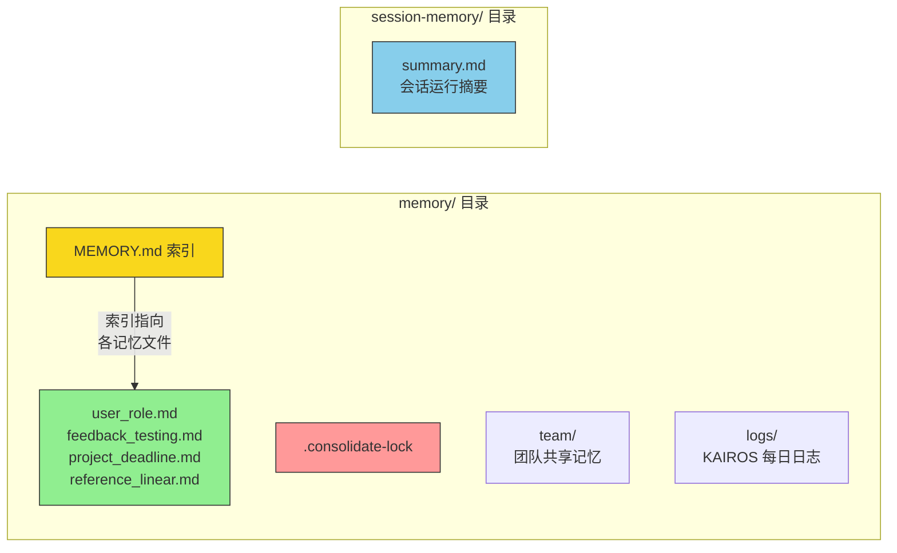

> 两个目录都在 `~/.claude/projects/<sanitized-git-root>/` 下面，但 `memory/` 是**跨会话共享**的（所有会话读写同一份记忆），而 `session-memory/` 是**每个会话独立**的（包含 session-id）。

**存储位置的确定** (文件: `src/memdir/paths.ts`, 278行):

系统按以下优先级确定记忆目录：
1. 环境变量 `CLAUDE_COWORK_MEMORY_PATH_OVERRIDE`（SDK/Cowork 全路径覆盖）
2. 设置文件中的 `autoMemoryDirectory`（仅信任 policy/local/user 来源）
3. 默认路径: `~/.claude/projects/<sanitized-git-root>/memory/`

这里的 `<sanitized-git-root>` 是你项目 git 根目录的路径经过清洗后的版本（去掉特殊字符，确保安全）。

**一个重要的设计决策**: 如果你用了 Git Worktree（比如多个分支同时在不同目录下工作），所有 worktree 都**共享同一个记忆目录**。因为记忆是关于你和项目的，不是关于某个分支的。

**目录结构**:

```
~/.claude/projects/-Users-you-myproject/memory/
  |
  +-- MEMORY.md                ← 索引文件（目录页）
  +-- user_role.md             ← "用户是高级后端工程师"
  +-- feedback_testing.md      ← "测试不能用 mock"
  +-- project_deadline.md      ← "3月5日代码冻结"
  +-- reference_linear.md      ← "Bug 追踪在 Linear"
  +-- .consolidate-lock        ← Auto-Dream 的进程锁（后面详解）
  +-- team/                    ← 团队共享记忆（如果启用）
  |   +-- MEMORY.md
  |   +-- *.md
  +-- logs/                    ← KAIROS 模式的每日日志
      +-- 2026/04/2026-04-05.md
```

### 15.3 一条记忆长什么样？

每条记忆是一个带有 **frontmatter**（元数据头）的 Markdown 文件。Frontmatter 是文件开头用 `---` 包围的 YAML 格式元数据：

```markdown
---
name: 测试策略
description: 集成测试必须使用真实数据库，不能 mock
type: feedback
---

集成测试必须用真实数据库，不能 mock。

**Why:** 上个季度 mock 测试通过了但生产环境数据库迁移失败了。
Mock 隐藏了字段类型差异和索引约束问题。

**How to apply:** 所有涉及数据库操作的测试都应该连接 test 数据库
（在 .env.test 中配置），使用 beforeEach 清理数据。
```

**三个元数据字段的作用**:
- `name`: 记忆的名称，用于索引和显示
- `description`: 一行描述——**这是决定记忆是否被加载的关键字段**。系统在判断"这条记忆和当前对话相关吗"时，主要看的就是这个字段
- `type`: 记忆类型（下面详解）

**解析逻辑** (文件: `src/memdir/memoryScan.ts`, 94行): 系统读取文件的前 30 行来提取 frontmatter，不会读取整个大文件。

### 15.4 四种记忆类型——一个封闭的分类体系

文件: `src/memdir/memoryTypes.ts` (271行)

Claude Code 定义了严格的四种记忆类型，每种都有明确的"什么时候该保存"和"怎么使用"的指南。

**1. user（用户画像）** — 始终私有

记录关于**你这个人**的信息：角色、目标、偏好、知识水平。

```markdown
---
name: 用户技术背景
description: 用户是 Go 专家，10年经验，但第一次接触 React
type: user
---

用户有深厚的 Go 后端经验（10年），但这是第一次接触这个仓库的 React 前端。
解释前端概念时，用后端类比会更有效（如"组件就像 Go 的 struct"）。
```

**什么时候创建？** 当你透露了关于自己的信息时：
- "我是数据科学家，在调查日志系统"
- "我写了十年 Go，但 React 是头一次碰"

**怎么使用？** Claude 会根据你的背景调整沟通方式。对资深工程师和编程新手，解释同一段代码的方式应该完全不同。

**2. feedback（行为反馈）** — 默认私有

记录你**对 Claude 工作方式的指导**——哪些做法应该停止，哪些应该继续。

```markdown
---
name: 不要在测试中用 mock
description: 集成测试必须使用真实数据库，因为曾因 mock/prod 差异导致迁移失败
type: feedback
---

集成测试必须用真实数据库，不能 mock。

**Why:** 上个季度 mock 测试通过但生产迁移失败了。
**How to apply:** 看到数据库相关测试时，连接 test 库而不是创建 mock。
```

**什么时候创建？** 两种情况都要注意——
- **纠正时**: "不要这样做"、"停止 X"、"别用 mock"
- **确认时**: "完美"、"对，就这样做"——确认也很重要，否则 Claude 只记住错误不记住正确做法，变得过于保守

**3. project（项目上下文）** — 倾向于团队共享

记录**项目中不能从代码或 git 推断出来的信息**：正在进行的工作、决策、截止日期。

```markdown
---
name: 代码冻结
description: 2026-03-05 起冻结所有非关键合并，移动端要切发布分支
type: project
---

2026-03-05 起代码冻结，移动端团队要切发布分支。

**Why:** 移动端发版流程要求冻结期间不合并非关键 PR。
**How to apply:** 3月5日之后安排的任何非关键 PR 工作都应该标记延迟。
```

**一个重要的细节**: 用户说"周四冻结"时，系统会把相对日期转换为绝对日期。因为"周四"过了一周就指向不同的日子了，但"2026-03-05"永远明确。

**4. reference（外部引用）** — 通常团队共享

记录**信息在外部系统中的位置**——不是信息本身，而是去哪里找信息。

```markdown
---
name: Bug 追踪在 Linear
description: 管道相关 bug 在 Linear 的 INGEST 项目中追踪
type: reference
---

管道相关的 bug 都在 Linear 的 "INGEST" 项目中追踪。
如果需要了解某个 pipeline bug 的上下文，查看那个项目。
```

### 15.5 记忆文件的完整生命周期——什么时候被写入、更新、删除？

这四种类型的记忆文件（user/feedback/project/reference）并不是由一个统一的"记忆管理器"来操作的。实际上有**三个不同的角色**可以写入它们，各自的触发条件和行为完全不同。

#### 角色 1: 主 Claude（你对话的那个 Claude）

**什么时候写入？**

主 Claude 在**两种情况**下会写入记忆:

**情况 A: 用户明确要求。** 你直接说"记住这个"或"以后别再用 mock 了":

```
你: "记住，我们团队禁止在测试中使用 mock 数据库"

Claude 的行动:
  1. Write("memory/feedback_testing.md", 带 frontmatter 的内容)
  2. Edit("memory/MEMORY.md", 添加索引条目)
```

**情况 B: 系统提示中的指引。** 系统提示告诉 Claude "当你了解到用户的角色、偏好、项目信息时，应该保存记忆"。所以即使你没有明确说"记住"，Claude 也可能在对话过程中主动创建记忆:

```
你: "我写了十年 Go，但 React 是头一次碰"

Claude 的行动 (可能在回答你问题的同时):
  1. Write("memory/user_expertise.md", 记录你的技术背景)
  2. Edit("memory/MEMORY.md", 添加索引)
```

**什么时候更新？** 当 Claude 发现新信息和已有记忆相关时。系统提示明确指示: "Update or remove memories that turn out to be wrong or outdated"（更新或删除过时的记忆）。例如:

```
[之前的记忆: "用户是 React 新手"]
[3 个月后的对话中你展示了高级 React 技巧]

Claude 的行动:
  1. Read("memory/user_expertise.md") → 读取当前内容
  2. Edit("memory/user_expertise.md") → 更新为"用户已熟练掌握 React"
```

**什么时候删除？** 用户明确说"忘记这个"时。系统提示写道: "If they ask you to forget something, find and remove the relevant entry"（如果用户要求忘记，找到并删除相关条目）:

```
你: "你可以忘掉关于代码冻结的记忆了，已经解冻了"

Claude 的行动:
  1. Bash("rm memory/project_deadline.md")  ← 删除文件
  2. Edit("memory/MEMORY.md") ← 移除索引条目
```

#### 角色 2: Extract Memories 后台 Agent

**什么时候写入？** 每轮对话结束后自动运行（详见 16.2 节）。这个后台 Agent 分析最近的消息，提取值得记住的信息。

**关键互斥规则**: 如果主 Claude 在这一轮已经手动写入了记忆文件，Extract Memories 就**跳过本轮**，避免重复。源码中 `hasMemoryWritesSince()` 函数检测主 Agent 是否在最近的消息中调用了 Write/Edit 工具并修改了 memory/ 目录下的文件。

```
主 Claude 写了记忆？
    +-- 是 → Extract Memories 跳过这轮，推进消息游标
    +-- 否 → Extract Memories 分析对话并可能写入记忆
```

**它能做什么？**
- 创建新文件: `Write("memory/feedback_no_comments.md")`
- 更新已有文件: 先 `Read` 再 `Edit`
- 更新 MEMORY.md 索引
- **不能删除文件**: 它的工具权限中没有 `rm` 命令

**具体例子**: 你在对话中无意间透露了一条有价值的信息但没有说"记住":

```
你: "我们这个项目用的是 pnpm 不是 npm，装依赖的时候注意"
Claude: "好的，我会用 pnpm install"
[对话结束]

[Extract Memories Agent 在后台启动]
Agent 分析: 用户提到了项目使用 pnpm，这是一条 project 类型的记忆
Agent 检查: 现有记忆中没有关于包管理器的记录
Agent 行动:
  1. Write("memory/project_package_manager.md")
     ---
     name: 包管理器
     description: 项目使用 pnpm 而不是 npm
     type: project
     ---
     项目使用 pnpm 作为包管理器，不是 npm。
     安装依赖时应使用 pnpm install。

  2. Edit("memory/MEMORY.md")
     添加: - [包管理器](project_package_manager.md) — 项目用 pnpm 不是 npm
```

#### 角色 3: Auto-Dream 整合 Agent

**什么时候操作？** 每 24+ 小时，满足 5 层门控后运行（详见 16.4 节）。

**它能做什么？** 这是唯一一个能做**全部操作**的角色:

| 操作 | 例子 |
|------|------|
| **创建新文件** | 从多个会话中发现了一个共同主题，汇总成一条新记忆 |
| **更新已有文件** | 追加新发现到现有记忆（如新的截止日期追加到 project 文件） |
| **合并重复文件** | 发现 `feedback_no_mock.md` 和 `feedback_testing.md` 说的是同一件事 → 合并 |
| **删除过时文件** | "等 Alice 的 review" → Alice 一周前已经 review 完了 → 删除 |
| **修复错误记忆** | 代码库中发现事实与记忆矛盾 → 更新记忆 |
| **整理索引** | MEMORY.md 超过 25KB → 精简；有死链 → 移除 |

**具体例子**: Auto-Dream 发现了重复和过时的记忆:

```
[Auto-Dream Agent 启动，扫描 memory/ 目录]

Phase 1 (Orient):
  ls memory/ → 发现 7 个文件
  Read MEMORY.md → 看到所有索引

Phase 2 (Gather):
  Read feedback_no_mock.md → "测试不能用 mock"
  Read feedback_testing.md → "集成测试必须用真实数据库"
  → 这两个说的是同一件事！

  Read project_alice_review.md → "等 Alice review PR #42"
  grep transcripts → 最近会话中 Alice 已经 approve 了
  → 这条已过时

Phase 3 (Consolidate):
  Edit feedback_testing.md → 合并 feedback_no_mock.md 的内容
  Bash("rm memory/feedback_no_mock.md") → 删除重复文件
  Bash("rm memory/project_alice_review.md") → 删除过时记忆

Phase 4 (Prune):
  Edit MEMORY.md → 移除两个已删文件的索引条目
```

#### 三个角色的完整对比

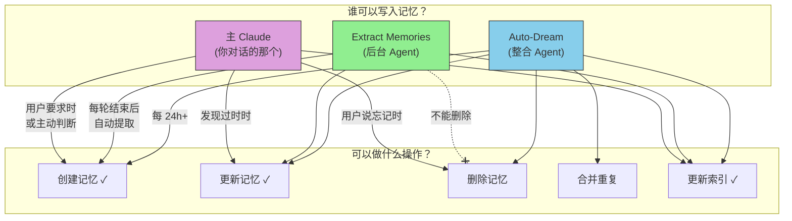

#### 四种记忆类型的写入/更新/删除场景汇总

| 类型 | 典型的写入触发 | 典型的更新触发 | 典型的删除触发 |
|------|--------------|--------------|--------------|
| **user** | 用户透露技术背景/角色/偏好 | 用户能力变化（新手→熟练） | 用户要求忘记，或角色彻底改变 |
| **feedback** | 用户纠正做法("别用 mock") 或确认做法("完美") | 规则细化("不只是 mock，ORM 也不要用") | Auto-Dream 发现和其他反馈矛盾 |
| **project** | 听到截止日期/决策/状态变化 | 日期推迟、状态更新 | 事件已过去("冻结已解除")，Auto-Dream 清理 |
| **reference** | 听到外部系统位置 | URL 变更、系统迁移 | 外部系统废弃 |

**一个重要的细微差别**: Extract Memories **不能删除文件**（它的工具权限中 `Bash rm` 是被禁止的），这是一个有意的安全限制——防止后台 Agent 误删重要记忆。只有主 Claude（用户明确要求时）和 Auto-Dream（深度分析后判断过时）才能删除记忆文件。

### 15.6 什么不应该记住——比记什么更重要

即使用户明确要求保存，以下信息也**不应该**被记住：

| 不该记的 | 为什么 | 应该去哪里找 |
|---------|--------|-------------|
| 代码模式、架构、文件路径 | 代码会变，记忆会过时 | 直接读代码 |
| Git 历史、谁改了什么 | git 本身就是权威 | `git log` / `git blame` |
| 调试解决方案 | 修复在代码里，上下文在提交消息里 | 看代码和 commit message |
| CLAUDE.md 中已有的内容 | 避免重复 | 读 CLAUDE.md |
| 临时任务细节、当前进展 | 只对当前会话有用 | 用 Task 系统追踪 |

**如果用户坚持要保存一个活动日志或 PR 列表怎么办？** Claude 应该问"这里面有什么是**出人意料的**或**不明显的**？"——只保存那部分。

### 15.7 记忆到底是怎么出现在对话里的？——注入机制详解

这是大家最容易困惑的部分。让我用一个完整的例子来说清楚。

下面这张图展示了两种记忆各自的注入路径:

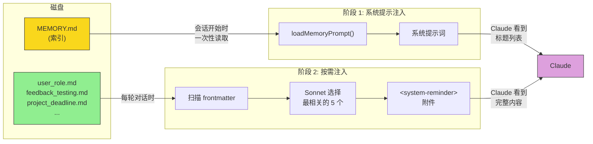

**首先，明确一个关键区分**:

```
memory/ 目录下有这些文件:
    MEMORY.md              ← 这是"索引"（目录页）
    user_role.md           ← 这是"记忆文件"（具体内容）
    feedback_testing.md    ← 这也是"记忆文件"
    project_deadline.md    ← 这也是"记忆文件"
```

**索引和记忆文件都会被注入到对话中，但方式完全不同:**

| | MEMORY.md (索引) | 具体记忆文件 (*.md) |
|---|---|---|
| **注入位置** | 系统提示词 | 对话中的 `<system-reminder>` 附件 |
| **注入时机** | 会话开始时，一次性加载 | 每轮对话时，按需选择 |
| **注入内容** | 索引的完整文本（标题列表） | 被选中文件的完整内容（含 frontmatter） |
| **谁来决定** | 无条件，始终注入 | Sonnet 模型根据相关性选择 |
| **最大大小** | 200 行 / 25KB | 每文件 200 行 / 4KB，每轮最多 5 个 |

现在让我一步步展示整个过程。

**阶段 1: MEMORY.md 索引——Claude 的"记忆目录"**

文件: `src/memdir/memdir.ts`

每次会话开始时，系统在构建系统提示词时调用 `loadMemoryPrompt()`。这个函数做的事很简单:

```
读取 ~/.claude/projects/.../memory/MEMORY.md
    |
如果超过 200 行或 25KB → 截断，加上溢出警告
    |
把内容嵌入系统提示词的 "# auto memory" 段落中
```

**Claude 看到的是这样的**（在系统提示词中）:

```
# auto memory

You have a persistent, file-based memory system at /Users/you/.claude/projects/.../memory/.
...（使用指南，约 100 行）...

MEMORY.md is always loaded into your conversation context:
- [用户技术背景](user_role.md) — Go 专家，React 新手
- [测试规范](feedback_testing.md) — 集成测试必须用真实数据库
- [代码冻结](project_deadline.md) — 2026-03-05 起冻结非关键合并
- [Bug 追踪](reference_linear.md) — 管道 bug 在 Linear INGEST 项目
```

注意: Claude 此时只看到**标题和一行描述**，看不到每条记忆的完整内容。它知道"有一条关于测试规范的记忆"，但不知道具体写了什么。

**阶段 2: 具体记忆文件——按需注入完整内容**

文件: `src/memdir/findRelevantMemories.ts`, `src/utils/attachments.ts`

每当你发送一条消息，系统会在**后台异步**启动一个"记忆选择"流程。

让我用一个具体例子说明整个过程。假设你输入了 "帮我给 UserService 加一个数据库迁移"。

系统此时启动了**两条并行的流水线**，它们同时运行、互不等待:

**流水线 A: 主流程** (处理你的问题)
```
把你的消息 + 历史对话 + 系统提示发给 Claude API
    → Claude 开始思考和生成回复（流式传输中...）
    → Claude 回复: "我来创建迁移文件"
       + tool_use: Write("migration.sql")
    → 执行工具: 创建迁移文件
    → 工具完成
```

**流水线 B: 记忆预取** (寻找相关记忆)
```
[步骤 1] 提取你消息中的关键词
    → "UserService, 数据库迁移"

[步骤 2] 扫描 memory/ 目录，读取每个 .md 文件的 frontmatter
    → "[user] user_role.md: Go 专家，React 新手"
    → "[feedback] feedback_testing.md: 不能用 mock"
    → "[project] project_deadline.md: 3月冻结"
    → "[reference] reference_linear.md: Linear 追踪"

[步骤 3] 调用 Sonnet 侧查询
    → 问 Sonnet: "用户在问数据库迁移，以下哪些记忆最相关？"
    → Sonnet 返回: ["feedback_testing.md"]

[步骤 4] 读取选中文件的完整内容
    → 读取 feedback_testing.md 全文（截断到 200 行 / 4KB）

[步骤 5] 去重检查
    → 上一轮没注入过这个文件 ✓
    → Claude 没通过 Read 工具主动读过它 ✓

[预取完成，结果等待使用]
```

**汇合点**: 当流水线 A 的工具执行完毕后，系统检查流水线 B 是否也完成了。如果完成了，就把预取到的记忆注入到下一轮消息中:

```
[流水线 A 工具完成] + [流水线 B 预取完成]
    → 把 feedback_testing.md 的完整内容包装为 <system-reminder> 附件
    → 附加到工具结果之后，一起发给 Claude API
    → Claude 在下一轮看到这条记忆，写测试时会用真实数据库
```

如果流水线 B 还没完成（比如 Sonnet 侧查询比较慢），系统**不会等待**——这轮就不注入记忆，下一轮再试。用户完全感知不到任何延迟。

**Claude 在下一轮看到的是这样的**（作为 `<system-reminder>` 标签）:

```xml
<system-reminder>
Memory (saved 3 days ago): feedback_testing.md:

---
name: 测试策略
description: 集成测试必须使用真实数据库
type: feedback
---

集成测试必须用真实数据库，不能 mock。

**Why:** 上个季度 mock 测试通过了但生产环境数据库迁移失败了。
**How to apply:** 所有涉及数据库的测试都应该连接 test 数据库。

> This memory is 3 days old. Memories are point-in-time observations...
> Verify against current code before asserting as fact.
</system-reminder>
```

Claude 看到这条记忆后，就会在写迁移脚本的同时，用真实数据库写测试——而不是用 mock。

**为什么预取是异步的？**

如果记忆选择要等 Sonnet 的 API 调用（可能几百毫秒），而 Claude 的主 API 调用也在进行中，**让它们并行**意味着用户几乎感知不到记忆加载的延迟。如果 Claude 在记忆加载完之前就回复了，记忆会在下一轮注入——不会阻塞当前轮次。

**去重逻辑为什么重要？**

想象 Claude 在第 3 轮已经看过了 `feedback_testing.md` 的完整内容。第 4 轮如果再注入同样的内容，就是**浪费 token**。系统通过两种方式去重:

1. `alreadySurfaced` 集合: 追踪之前轮次已经作为 `<system-reminder>` 注入过的文件路径
2. `readFileState` 缓存: 追踪 Claude 通过 Read 工具主动读取过的文件路径

**上下文压缩后去重重置**: 当 Autocompact 发生时，旧的 `<system-reminder>` 附件被摘要替代，去重记录也被清除——之前注入过的记忆可以重新被选中注入。

### 15.8 所有记忆的注入时机一览

下图展示了一次会话中，各种记忆在什么阶段进入 Claude 的视野:

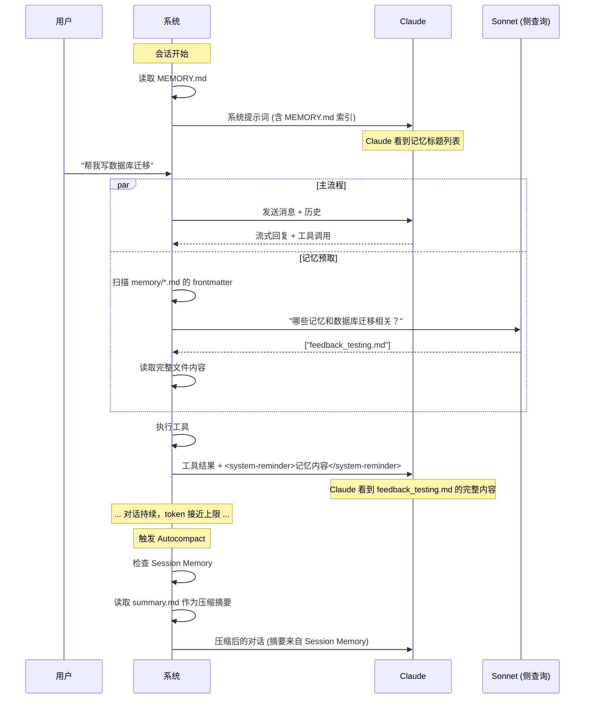

为了避免混淆，这里用表格汇总所有种类的"记忆"各自在什么时刻、以什么方式进入 Claude 的视野:

| 记忆种类 | 注入时机 | 注入方式 | Claude 看到什么 |
|---------|---------|---------|----------------|
| **MEMORY.md 索引** | 每个会话开始时 | 嵌入系统提示词 | 记忆标题列表（只有名称和一行描述） |
| **具体记忆文件** (user_*.md 等) | 每轮对话时，由 Sonnet 按需选择 | `<system-reminder>` 附件 | 被选中文件的完整内容（含 frontmatter + 正文，最大 4KB） |
| **Session Memory** (summary.md) | 上下文被压缩时 | 作为 Autocompact 的预制摘要替代传统摘要 | 压缩摘要中包含 summary.md 的内容（Claude 不知道它来自 Session Memory） |
| **团队记忆** (team/*.md) | 和具体记忆文件相同（按需选择） | `<system-reminder>` 附件 | 和个人记忆相同的格式 |
| **KAIROS 每日日志** (logs/*.md) | 不直接注入对话；由 /dream skill 整理后写入 MEMORY.md | 间接（通过 MEMORY.md 索引） | 整理后的结构化记忆 |

**注意**: Claude 只会主动"看到"前三种。团队记忆和每日日志是通过其他机制间接进入对话的。

### 15.9 预算控制——记忆不能无限膨胀

记忆系统有严格的多层预算控制：

| 层级 | 限制 | 目的 |
|------|------|------|
| 单文件 | 最多 200 行 / 4,096 字节 | 防止单条记忆占用过多 token |
| MEMORY.md 索引 | 最多 200 行 / 25,000 字节 | 系统提示不能太长 |
| 单轮注入 | 最多 5 个文件 (≈20KB) | 控制每轮成本 |
| 会话总预算 | 累计 60KB | 3 轮满额注入后停止预取 |
| 目录扫描 | 最多 200 个 .md 文件 | 防止扫描耗时 |

**会话预算重置**: 当上下文被压缩（Autocompact）时，旧的注入被清除，预算重置。这意味着超长会话中记忆可以"重新注入"。

### 15.10 记忆的三种创建方式

**方式 1: Claude 自动提取（后台）**

每轮对话结束后，一个后台 Agent 自动扫描最近的消息，提取值得记住的信息。这是最常见的方式，用户完全无感。（详见第 16 章）

**方式 2: 用户明确要求**

用户可以直接说"记住这个"，Claude 会立即创建记忆文件。流程是两步走的：
1. 用 Write 工具创建 `.md` 文件（带 frontmatter）
2. 用 Edit 工具在 `MEMORY.md` 中添加索引条目

**方式 3: 手动管理**

用户可以用 `/memory` 命令打开记忆文件选择器，浏览、编辑、创建记忆文件。这是一个 React Ink UI 组件（文件: `src/components/memory/MemoryFileSelector.tsx`），提供了可视化的记忆管理界面。

### 15.11 团队记忆——跨团队共享知识

文件: `src/services/teamMemorySync/` (5个文件)

除了个人记忆，Claude Code 还支持**团队记忆**——存在 `memory/team/` 子目录下，通过 API 在团队成员之间同步。

**同步机制**:

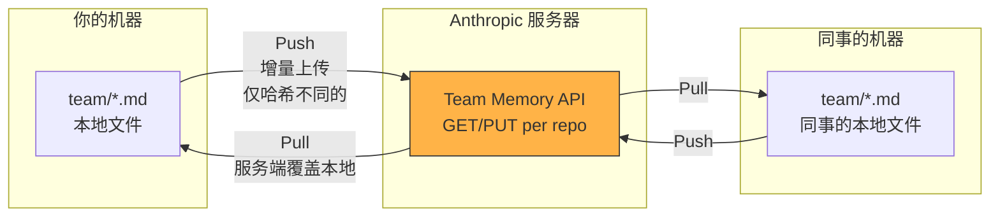

**同步规则**:
- **拉取**: 服务器内容覆盖本地（服务端赢）
- **推送**: 只上传内容哈希不同的条目（增量传输）
- **删除不传播**: 你本地删了一个文件，服务器不会删——防止误操作影响团队
- **冲突处理**: 服务器返回 412 时，客户端刷新哈希重新解决

**安全措施**: 推送前会用 Gitleaks 扫描内容，防止 API Key 等敏感信息泄露到团队记忆中。单条最大 250KB，单次推送最大 200KB。

### 15.12 记忆的安全性

文件: `src/memdir/paths.ts` 中有严格的路径验证：
- 拒绝相对路径（`../foo`）
- 拒绝根路径和近根路径（`/`, `/a`）
- 拒绝 Windows 驱动器根（`C:\`）
- 拒绝 UNC 路径（`\\server\share`）
- 拒绝 null 字节
- 所有路径 NFC Unicode 规范化（防止 macOS HFS+ 的 Unicode 分解绕过）

自动提取的 Agent 只能在 memory 目录内写入，不能修改项目代码。

### 15.13 记忆与 CLAUDE.md 的区别

很多人会混淆这两个系统：

| | CLAUDE.md | Memory 系统 |
|---|---|---|
| 谁写的 | **你手动写的** | **Claude 自动提取的**（或你要求的） |
| 存在哪 | 项目根目录 `.claude/CLAUDE.md` | `~/.claude/projects/.../memory/` |
| 什么内容 | 项目规范、代码约定、构建命令 | 用户偏好、反馈、项目动态 |
| 多久更新 | 你手动维护 | 每次对话后自动更新 |
| 加载方式 | 作为用户上下文注入 | 两阶段注入（索引+按需） |

简单说: **CLAUDE.md 是"项目说明书"，Memory 是"个人备忘录"。**

---

## 第 16 章: 睡梦中的整理——自动记忆提取与 Auto-Dream

### 16.1 三种"整理师"——它们到底有什么区别？

这是很多人容易混淆的地方。Claude Code 有三种自动记忆整理机制，它们的**目的完全不同**。

下图展示了三种机制各自的数据流向:

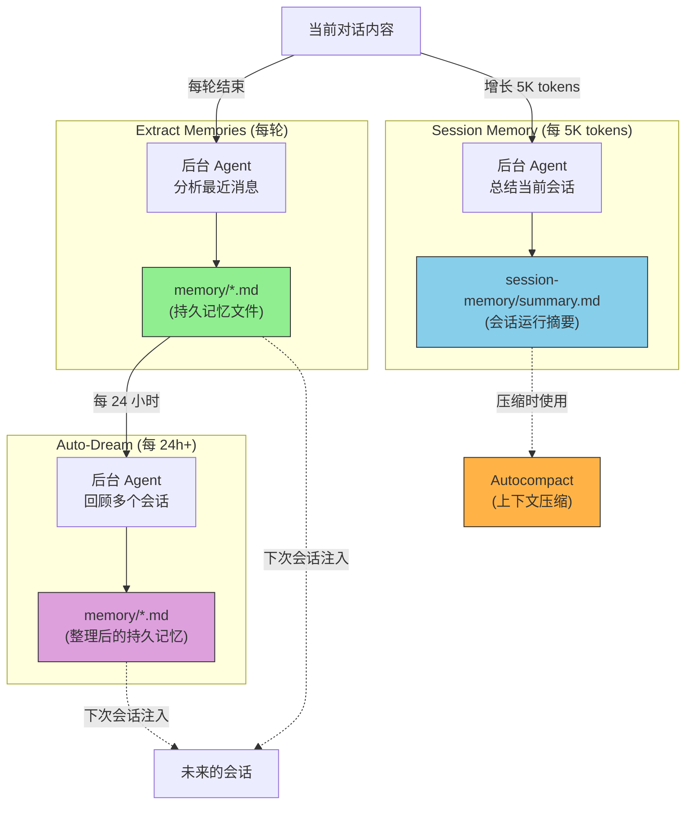

先用一个日常比喻来理解它们的区别:

```
想象你有一个新入职的实习生（Claude），你每天和他开会讨论工作。

Extract Memories = 会议记录员
    每次会议结束后，记录员把关键决策和信息摘录下来，
    存入"公司知识库"（memory/ 目录），供以后所有会议参考。
    
    核心问题: "这次会议有什么值得长期记住的？"
    写入位置: memory/feedback_testing.md 等持久记忆文件
    保留周期: 永久（跨所有会话）

Session Memory = 会议纪要
    在一次很长的会议中（比如 3 小时），纪要员定期总结
    "到目前为止我们讨论了什么"，方便会议后半段回顾。
    
    核心问题: "这次会议到现在讨论了哪些要点？"
    写入位置: <project>/<session-id>/session-memory/summary.md
    保留周期: 仅限当前会话

Auto-Dream = 每周知识库整理
    每个周末，一个专人回顾过去一周所有会议的记录，
    合并重复的、删除过时的、补充遗漏的。
    
    核心问题: "这些记忆需要整理、合并或删除吗？"
    操作对象: memory/ 目录中已有的持久记忆文件
    触发频率: 每 24+ 小时，且至少 5 个新会话后
```

**关键区别在于: 写到哪里，以及为谁服务**:

| | Extract Memories | Session Memory | Auto-Dream |
|---|---|---|---|
| **写到哪** | `memory/*.md` (持久) | `<session>/session-memory/summary.md` (会话级) | 修改 `memory/*.md` (持久) |
| **为谁服务** | **未来的会话** | **当前会话的后半段** | **未来的会话** |
| **做什么** | 从对话中**提取新信息** | 为当前对话**写运行摘要** | 对已有记忆**整理归档** |
| **触发频率** | 每轮结束后 | 每增长约 5K token | 每 24+ 小时 |
| **会话结束后还有用吗？** | 有（永久保存） | 没有（随会话消亡） | 有（改善持久记忆质量） |

现在让我详细解释每一个。

### 16.2 Extract Memories（即时提取员）——"这次对话有什么值得长期记住的？"

文件: `src/services/extractMemories/extractMemories.ts` (615行)

**触发时机**: 每次 query 循环正常结束后（Claude 回复了且没有更多工具调用）

**比喻**: 就像一个会议速记员——每次会议结束后立即整理纪要，不等到周末。

**完整的触发和执行流程**:

```
用户和 Claude 完成了一轮对话
    |
[handleStopHooks] 在 query/stopHooks.ts 中触发
    |
executeExtractMemories()  ← fire-and-forget（不阻塞主会话）
    |
[门控检查 - 满足才继续]
    +-- feature flag: EXTRACT_MEMORIES 编译时启用？
    +-- GrowthBook: tengu_passport_quail 运行时启用？
    +-- 仅主 Agent（子 Agent 不做提取）
    +-- auto-memory 没被禁用？
    +-- 非远程模式？
    |
[互斥检查]
    +-- 主 Agent 在这轮已经手动写了记忆？ → 跳过（避免重复）
    +-- 上一次提取还在进行中？ → 排队等它完成后再做一次
    |
[节流检查]
    +-- 每 N 轮做一次（默认 N=1，通过 GrowthBook 可调）
    |
[启动后台 Agent]
    +-- fork 主会话的上下文（共享 prompt cache，省钱）
    +-- 最多运行 5 轮
    +-- 注入现有记忆清单（防止创建重复）
    +-- 工具限制:
    |   允许: Read, Grep, Glob（无限制）
    |   允许: 只读 Bash（ls, find, cat, stat, wc, head, tail）
    |   允许: Edit/Write（仅限 memory 目录内）
    |   禁止: 其他所有写入工具
    |
[Agent 分析最近的对话]
    "我看看最近的消息有什么值得记住的..."
    |
[Agent 执行操作]
    +-- 创建新文件: feedback_no_comments.md
    +-- 更新现有文件: 在 project_deadline.md 中追加新信息
    +-- 更新 MEMORY.md 索引
    |
[完成]
    追加系统消息: "Saved 2 memories"
```

**合并运行 (Coalescing)**: 如果用户打字很快，连续几轮都结束了但上一次提取还没完，系统不会同时启动多个 Agent。它会记住"有一次排队等着"，等当前完成后**再做一次**，使用最新的上下文。

**关机保护**: 当用户按 Ctrl+D 退出时，`drainPendingExtraction()` 会等待进行中的提取完成（最多 60 秒），确保最后一轮对话的记忆不丢失。

### 16.3 Session Memory（会话笔记）——"这次对话到目前为止发生了什么？"

文件: `src/services/SessionMemory/sessionMemory.ts` (495行)

Session Memory 和 Extract Memories 经常被混淆，但它们的目的**完全不同**。让我用一个对比例子说明:

```
一次 3 小时的会话中:

[第 1 小时] 你让 Claude 调查项目的 API 性能问题
[第 2 小时] Claude 发现了 N+1 查询问题并修复
[第 3 小时] 上下文被压缩了，Claude "忘了" 前 2 小时的细节

这时候你说: "刚才那个 N+1 问题最终怎么修的？"

没有 Session Memory: Claude 回答 "对不起，上下文已经被压缩了，我不记得细节了"
有 Session Memory: Claude 查阅 summary.md → "在 UserService.ts:89 中，
                   把 findAll() 改成了 findAllWithJoin()，测试通过了"
```

**Session Memory 是当前会话的"运行日志"**，帮助 Claude 在上下文压缩后仍然能回忆起本次会话的重要细节。它不是给未来会话用的——会话结束后就没用了。

**存储位置**:

```
~/.claude/projects/<project>/<session-id>/session-memory/summary.md
```

注意这个路径包含 `<session-id>`——每个会话有自己独立的 summary 文件。而 Extract Memories 写入的是 `memory/` 目录，所有会话共享。

**Session Memory 什么时候被"注入"到对话中？**

这是 Session Memory 最特殊的地方——它不像持久记忆那样通过 `<system-reminder>` 注入。它的注入时机是**上下文压缩时**:

```
对话进行了 2 小时，上下文接近限制
    |
触发 Autocompact（第 17 章详解）
    |
系统检查: 有 Session Memory 可用吗？
    |
[有 summary.md 且内容不为空]
    → 用 summary.md 作为压缩后的摘要
    → 不需要让 Claude 重新读一遍对话来生成摘要（省一次 API 调用）
    → 保留 summary 之后的新消息
    |
[没有 summary.md]
    → 回退到传统压缩: 让 Claude 自己总结之前的对话
```

换句话说: **Session Memory 是 Autocompact 的"预制摘要"**。因为后台 Agent 一直在更新 summary.md，当压缩触发时，系统直接拿这个摘要来用，而不需要再花一次 API 调用让 Claude 重新阅读和总结。

这也解释了为什么 Session Memory 只在"自动压缩已启用"时才工作——如果不做压缩，就不需要预制摘要。

**触发条件** (源码: `shouldExtractMemory()` 函数):

Session Memory 的更新不是每轮都执行，它有精确的触发逻辑:

```
1. 初始化阈值: 上下文至少积累了 10K tokens
   （一个只有几句话的短会话不需要 Session Memory）

2. 更新阈值: 距上次提取已增长 5K tokens
   （避免过于频繁的提取）

3. 工具调用阈值: 至少有 3 次新的工具调用
   （纯聊天不需要，有工具调用说明做了实际工作）

4. 触发逻辑:
   (满足 token 阈值 AND 满足工具调用阈值)
   OR
   (满足 token 阈值 AND 最后一轮没有工具调用——自然停顿点)
```

**重要**: token 阈值是**始终必要**的。即使工具调用达标了，token 不够也不会触发，防止过度提取。

**文件权限**: `0o600`（仅用户可读写），因为 Session Memory 可能包含对话中的敏感信息。

#### summary.md 的完整生命周期

**创建**: 当 `shouldExtractMemory()` 第一次返回 true 时，`setupSessionMemoryFile()` 创建文件并写入一个预定义的**模板**。模板包含 8 个固定章节:

```markdown
# Session Title
_A short and distinctive 5-10 word descriptive title for the session._

# Current State
_What is actively being worked on right now? Pending tasks not yet completed._

# Task specification
_What did the user ask to build? Design decisions or other context._

# Files and Functions
_Important files? What do they contain and why are they relevant?_

# Workflow
_What bash commands are usually run and in what order?_

# Errors & Corrections
_Errors encountered and how they were fixed. What approaches failed?_

# Codebase and System Documentation
_Important system components? How do they work/fit together?_

# Learnings
_What has worked well? What has not? What to avoid?_

# Key results
_If the user asked for specific output, repeat the exact result here._

# Worklog
_Step by step, what was attempted, done? Very terse summary._
```

文件创建使用 `flag: 'wx'`（O_CREAT|O_EXCL），意味着只在文件**不存在**时创建——如果文件已存在（比如同一会话中多次触发），跳过创建保留原有内容。

**更新**: 后续每次触发时，系统启动一个 forked Agent，它拿到当前 summary.md 的完整内容和对话上下文，用 `Edit` 工具**就地修改**文件。

关键规则（来自源码 `prompts.ts` 中的提示指令）:
- **不能改模板结构**: 8 个章节标题和斜体描述行必须原封不动保留
- **只改内容**: 在每个章节描述行下面填充/更新具体内容
- **并行编辑**: 所有 Edit 调用在一轮中并行发出，然后停止
- **内容限制**: 每个章节不超过约 2,000 token，总量不超过 12,000 token
- **不加废话**: 没有新内容的章节留空，不写"暂无信息"之类的填充

一次更新后 `# Current State` 可能变成:

```markdown
# Current State
_What is actively being worked on right now?_

正在重构 auth 模块。已修复 auth.ts:42 空值 bug，测试通过。
下一步: 更新 session.ts 的 token 过期处理。
```

**删除**: 源码中**没有 summary.md 的删除逻辑**。文件路径包含 session-id，新会话会创建自己的新 summary.md。旧会话的文件留在磁盘上，但不再被任何代码引用——它们是"孤儿文件"，自然消亡。

**手动触发**: 用户输入 `/summary` 命令可以调用 `manuallyExtractSessionMemory()`，跳过所有阈值检查，强制立即更新 summary.md。这在你觉得"当前对话很重要，想确保摘要是最新的"时有用。

### 16.4 第三层: Auto-Dream（定期大整理）

文件: `src/services/autoDream/autoDream.ts` (324行)

如果说 Extract Memories 是"每天记日记"，Auto-Dream 就是"每周回顾并整理日记"。它不只看最近一次对话，而是**跨多个会话**回顾和整合记忆。

**比喻**: 想象你有一个记事本，每天都往里写东西。一周后你发现：
- 有些笔记重复了（"3月5日冻结"写了三次）
- 有些已经过时了（"等 Alice 的 review"——她上周已经 review 完了）
- 有些分散的信息可以合并成一条

Auto-Dream 就是做这个整理工作的。

**五层门控** (从最便宜的检查开始，用决策树表示):

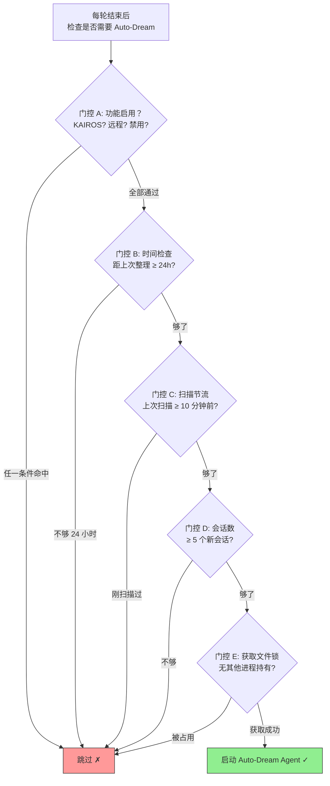

```
[门控 A: 启用检查 — 最快]
    KAIROS 模式？ → 跳过（KAIROS 用自己的 /dream skill）
    远程模式？ → 跳过
    auto-memory 禁用？ → 跳过
    GrowthBook tengu_onyx_plover 没开？ → 跳过

[门控 B: 时间检查 — 读一次文件]
    读取 .consolidate-lock 的修改时间 = 上次整理的时间
    距离上次整理不到 24 小时？ → 跳过

[门控 C: 扫描节流 — 防止频繁 I/O]
    上次扫描不到 10 分钟前？ → 跳过
    （这个门控避免每轮都扫描会话目录）

[门控 D: 会话数检查 — 扫描目录]
    扫描项目目录，找出上次整理后有变更的会话
    排除当前会话（它的 mtime 总是最新的）
    不到 5 个新会话？ → 跳过

[门控 E: 锁检查 — 防止并发]
    尝试获取 .consolidate-lock 文件
    锁的内容是持有进程的 PID
    有其他活跃进程持有锁？ → 跳过
    有死进程持有锁超过 1 小时？ → 回收锁
```

**为什么要 5 层？** 因为 Auto-Dream 需要启动一个完整的 Agent 会话，成本不低（API 调用 + token 消耗）。5 层门控确保只在**真正有必要**时才运行。大部分时候在门控 B（时间检查）就返回了，消耗几乎为零。

**整理执行（四阶段）**:

当所有门控通过后，系统启动一个 forked agent，按照精心设计的提示执行四个阶段：

```
阶段 1 - 环顾 (Orient)
    ls memory 目录
    读取 MEMORY.md
    浏览现有记忆文件的标题和描述

阶段 2 - 收集 (Gather)
    检查是否有新的会话转录
    搜索已有记忆中是否有被否定或更新的信息
    在转录中 grep 特定的可疑关键词

阶段 3 - 整合 (Consolidate)
    更新现有记忆: 追加新发现到相关文件
    创建新记忆: 如果有全新的主题
    合并重复: 多个文件说同一件事 → 合并为一个
    删除过时: "等 Alice review" → Alice 已经 review 完了

阶段 4 - 修剪 (Prune)
    更新 MEMORY.md 索引
    移除指向已删除文件的索引条目
    确保索引保持在 ~25KB 以内
```

**失败保护**: 如果 Agent 执行过程中出错，系统会**回滚锁的时间戳**到获取前的值。这意味着下次检查时时间门控会再次通过，自动重试。不会因为一次失败就永远跳过。

**锁机制详解** (文件: `src/services/autoDream/consolidationLock.ts`, 140行):

```
文件: memory/.consolidate-lock
内容: 持有进程的 PID（用于检测死进程）
mtime: 上次成功整理的时间（用于时间门控）

获取锁: 写入自己的 PID
释放锁: 不删除文件，而是更新 mtime 为当前时间（记录"整理完成"）
回收锁: 如果锁的 PID 对应的进程已死（kill(pid,0) 失败）且超过 1 小时
回滚锁: 失败时将 mtime 恢复到获取前的值
```

**这个设计很巧妙**: 锁文件既是互斥量（通过 PID），又是时间戳（通过 mtime）。一个文件双重用途。

### 16.5 三者对比: 一张图说清楚

```
时间线:
  会话 1          会话 2          会话 3          夜间
  |-------|       |-------|       |-------|       |-----|
  
  Extract ↓       Extract ↓       Extract ↓
  (每轮提取       (每轮提取       (每轮提取
   持久记忆)       持久记忆)       持久记忆)
   
  Session ↓       Session ↓       Session ↓
  (会话内         (会话内         (会话内          Auto-Dream ↓
   运行摘要,       运行摘要,       运行摘要,       (回顾会话1-3,
   会话结束        会话结束        会话结束         整合所有记忆)
   后无用)         后无用)         后无用)
```

| | Extract Memories | Session Memory | Auto-Dream |
|---|---|---|---|
| **核心问题** | "有什么值得跨会话记住的？" | "本次会话到目前为止发生了什么？" | "已有记忆需要整理吗？" |
| **触发频率** | 每轮结束后 | 每增长 5K tokens | 每 24+ 小时 |
| **写入位置** | `memory/*.md` | `<session>/session-memory/summary.md` | 修改 `memory/*.md` |
| **存活周期** | 永久 | 仅限当前会话 | 永久（改善已有记忆） |
| **看多少上下文** | 只看最新几条消息 | 看整个当前会话 | 回顾多个会话 |
| **能做什么** | 创建/更新记忆 | 更新单个 summary 文件 | 创建/更新/合并/删除记忆 |
| **比喻** | 会议结束后写记录 | 会议中间做纪要 | 周末整理归档 |
| **运行成本** | 低 | 低 | 中等 |

它们是**互补**的三个层次:
1. **Session Memory** 保证**当前会话内**不因压缩丢失关键上下文
2. **Extract Memories** 保证**跨会话**的重要信息被持久化
3. **Auto-Dream** 保证**持久记忆**的质量——合并重复、删除过时、填补遗漏

### 16.6 KAIROS 模式的特殊处理

KAIROS（常驻助手模式）对记忆整理做了两个关键修改:

**修改 1: Auto-Dream 被禁用**

```typescript
// autoDream.ts 第 96 行
if (getKairosActive()) return false  // 直接跳过
```

原因: KAIROS 会话可能连续运行很多小时。代码级的 Auto-Dream 是为"多个短会话"设计的，不适合一个超长会话。

替代方案: KAIROS 使用 `/dream` 磁盘 skill 来完成同样的工作，可以在夜间定时触发。

**修改 2: 追加式每日日志**

普通模式下记忆是"读写"的——Claude 可能读取一个记忆文件、修改它、再写回。KAIROS 模式下改为**追加式日志**:

```
memory/logs/2026/04/2026-04-05.md
```

日志只在末尾追加新行，永远不修改已有内容。

**为什么？** KAIROS 运行很多小时，中间可能有长时间的 Sleep。如果两个操作（一个在 Sleep 前，一个在 Sleep 后）都试图修改同一个文件，可能产生冲突。追加式日志从设计上消除了这个问题。

---

## 第 17 章: 不会忘记的对话——上下文窗口管理

### 17.1 为什么需要上下文管理？

想象你和一个人进行了 8 小时的对话。你们讨论了 50 个文件、运行了 100 条命令、来回了 200 条消息。如果把所有这些信息都"记在脑子里"，需要的"脑容量"是巨大的。

Claude 的"脑容量"就是**上下文窗口**——它一次能处理的最大文本量。Claude Code 使用 1M context 版本，理论上支持约 100 万 token（大约 300 万个中文字符或 75 万个英文单词）。

但实际上不能等到 100 万 token 用完才管理——因为:
1. 越接近上限，API 成本越高（按 token 计费）
2. 太长的上下文可能导致模型"注意力分散"，回答质量下降
3. 如果正好超过限制，API 会直接报错（Prompt Too Long）

所以 Claude Code 有一个精密的**三级压缩系统**，像三道防线一样管理上下文。

### 17.2 压缩阈值是怎么计算的？

文件: `src/services/compact/autoCompact.ts`

这个问题很多人会搞错——**压缩阈值不是一个写死的数字**，而是根据你使用的模型动态计算的。

**计算公式**:

```
有效窗口 = 模型的上下文窗口 - 输出预留 (最多 20,000 tokens)
自动压缩阈值 = 有效窗口 - 缓冲区 (13,000 tokens)
```

**输出预留**是留给 Claude 生成回复的空间——上下文窗口要装下"之前的对话 + Claude 即将生成的回复"，所以要给回复留出位置。20,000 token 是基于实际数据（p99.99 的压缩摘要输出为 17,387 token）设定的。

**具体例子**:

| 模型 | 上下文窗口 | 有效窗口 | 自动压缩阈值 | 占比 |
|------|-----------|---------|-------------|------|
| Opus 4.6 (1M) | 1,000,000 | 980,000 | 967,000 | ~96.7% |
| Sonnet (200K) | 200,000 | 180,000 | 167,000 | ~83.5% |

**环境变量覆盖**: 你可以通过 `CLAUDE_AUTOCOMPACT_PCT_OVERRIDE` 设置百分比来覆盖默认阈值。比如设为 `80`，阈值就变成有效窗口的 80%。

另外还有一个独立的限制: `CLAUDE_CODE_AUTO_COMPACT_WINDOW` 可以直接设置上下文窗口的绝对值上限。

### 17.3 第一级: Microcompact——轻量级的工具输出清理

文件: `src/services/compact/apiMicrocompact.ts` + `src/services/compact/microCompact.ts`

Microcompact 是最轻量的压缩方式——它不改变对话的结构，只是清理掉旧的工具输出。

**比喻**: 你的办公桌上堆满了查阅过的参考资料。你不需要把它们扔掉，只需要收到旁边的柜子里。对话的"骨架"（你说了什么、Claude 回复了什么、调用了哪些工具）都保留，只是工具返回的大段文本被清空了。

**两种触发方式**:

**方式 1: Token 触发（API 原生）**

当输入 token 超过 `DEFAULT_MAX_INPUT_TOKENS`（默认 180,000）时，API 端会自动清理工具结果。

```
之前:
  [user]: "查看 auth.ts"
  [assistant]: tool_use: Read("auth.ts")
  [tool_result]: "import express from 'express';\n... (3000行完整文件内容)"
  
之后 (Microcompact):
  [user]: "查看 auth.ts"
  [assistant]: tool_use: Read("auth.ts")
  [tool_result]: ""  ← 内容被清空，但消息结构保留
```

它保留最近约 40,000 token 的工具结果不清理——因为最近的工具输出 Claude 很可能还在引用。

**只清理这些"安全"的只读工具**:
- Bash (只读命令)
- Glob
- Grep  
- FileRead
- WebSearch

**不清理**的工具结果: FileEdit, FileWrite（因为这些记录了 Claude 做了什么修改，清除后 Claude 可能重复操作）。

**方式 2: 时间触发**

文件: `src/services/compact/timeBasedMCConfig.ts`

```
距离上次 API 调用超过 60 分钟？
    → Prompt cache 肯定已过期（cache TTL 约 5 分钟）
    → 清理工具结果可以减少重新缓存的 token 数量
    → 触发 Microcompact
```

这是一个**成本优化**: prompt cache 过期后，无论如何要重新传输所有 token。趁机清理掉不需要的内容可以节省传输成本。

### 17.4 第二级: Snip Compact——从中间剪掉旧消息

当 Microcompact 不够时（清理了工具输出但 token 还是太多），系统会从对话历史的**中间部分**删除旧消息。

```
之前:
  [消息 1] 用户的第一个问题
  [消息 2] Claude 的回答 + 工具调用
  [消息 3] 工具结果
  [消息 4] 用户的第二个问题     ← 这些会被删除
  [消息 5] Claude 的回答        ← 这些会被删除
  [消息 6] 工具结果             ← 这些会被删除
  [消息 7] 用户最近的问题
  [消息 8] Claude 最近的回答
  
之后:
  [消息 1] 用户的第一个问题     ← 保留开头
  [消息 7] 用户最近的问题       ← 保留最近
  [消息 8] Claude 最近的回答    ← 保留最近
```

**比喻**: 翻一本很厚的笔记本，把中间几十页撕掉，只留第一页（项目概述）和最后几页（最近的工作）。

**这是一个特性门控功能** (`feature('HISTORY_SNIP')`)，不一定在所有构建中启用。

### 17.5 第三级: Autocompact——完整的 AI 摘要

当前两级都不够用时，Autocompact 会启动——用 Claude 自己来**总结**之前的对话。

```
之前 (假设 80,000 tokens):
  [3小时的对话，包含 50 条消息、30 次工具调用]

之后 (约 2,000 tokens):
  [对话摘要]:
  "用户请求重构 auth 模块。经过分析，主要问题是:
   1. auth.ts:42 缺少空值检查（已修复）
   2. session.ts:89 的 token 过期逻辑有 bug（已修复）
   3. 添加了 auth.test.ts 集成测试（使用真实数据库）
   所有测试通过，变更已提交为 commit abc123。
   用户对结果满意。"
```

**比喻**: 请一个助手读完你 3 小时的会议记录，写出一页精华摘要。

**摘要后的特殊处理**:
- 如果摘要中引用了某些文件，每个文件最多保留 5,000 token 的内容（`POST_COMPACT_MAX_TOKENS_PER_FILE`）
- 图片和文档附件被替换为 `[image]` / `[document]` 占位符（节省大量 token）
- 会话压缩后记忆预算重置，之前注入的记忆可以重新加载

### 17.6 如果所有压缩都救不了？—— Prompt Too Long 恢复

有时候，即使压缩了，消息仍然太长（比如用户粘贴了一个巨大的文件）。这时 API 会返回 "prompt too long" 错误。

Claude Code 的恢复策略:

```
[API 返回 "prompt too long"]
    |
[第 1 次尝试: 响应式压缩 (Reactive Compact)]
    强制执行 Autocompact（即使没达到阈值）
    |
[如果还是太长: 截断头部消息]
    从对话开头删除最旧的消息
    |
[渐进式重试]
    每次重试增大 max_output_tokens: 8K → 16K → 32K → 64K
    更大的输出空间给了 Claude 更多"呼吸的余地"
```

**熔断机制**: 如果连续 3 次 Autocompact 都失败（比如上下文无论怎么压缩都太长），系统会停止尝试，避免无限循环浪费 API 调用。

### 17.7 压缩与 Prompt Cache 的微妙关系

Claude API 有一个重要的成本优化: **Prompt Cache**。如果连续的 API 调用使用相同的前缀（系统提示 + 历史消息的前面部分），API 端会缓存这些内容，后续调用只需要支付约 10% 的 token 费用。

**这就产生了一个矛盾**: 压缩会改变消息内容 → 缓存失效 → 下一次调用要重新支付全部 token 费用。

```mermaid
flowchart TD
    subgraph "正常情况: 缓存命中"
        A1["第 N 次 API 调用<br/>系统提示 + 历史消息"] -->|"前缀相同"| CACHE1["Prompt Cache<br/>命中 ✓"]
        CACHE1 -->|"只付 10% 费用"| COST1["低成本"]
    end

    subgraph "压缩后: 缓存失效"
        A2["Autocompact<br/>改变了消息内容"] -->|"前缀变了"| CACHE2["Prompt Cache<br/>失效 ✗"]
        CACHE2 -->|"重新付 100% 费用"| COST2["高成本"]
    end

    subgraph "Microcompact: 缓存友好"
        A3["API 原生清理<br/>只删工具输出"] -->|"API 端知道<br/>这是清理操作"| CACHE3["Prompt Cache<br/>保留 ✓"]
        CACHE3 -->|"仍只付 10%"| COST3["低成本"]
    end

    style COST1 fill:#90EE90,stroke:#333,color:#333
    style COST2 fill:#ff9999,stroke:#333,color:#333
    style COST3 fill:#90EE90,stroke:#333,color:#333
```

Claude Code 的解决方案:

1. **Microcompact 不破坏缓存**: 它使用 API 原生的 `clear_tool_uses` 功能，服务端知道这是清理操作，不会导致缓存失效

2. **粘性 header 锁存器**: `bootstrap/state.ts` 中有几个"一旦开启就不关闭"的标志:
   - `afkModeHeaderLatched` — AFK 模式头部
   - `fastModeHeaderLatched` — 快速模式头部
   - `cacheEditingHeaderLatched` — 缓存编辑头部
   
   这些标志一旦激活就保持开启，防止模式切换导致 ~50-70K token 的 prompt cache 失效。就像一个开关拨上去就不拨回来。

3. **工具排序稳定性**: `assembleToolPool()` 中内置工具按名称排序后作为前缀，MCP 工具追加在后。这确保增减 MCP 工具不会打乱内置工具的顺序，从而不会破坏缓存。

4. **时间触发 Microcompact**: 当系统检测到距离上次 API 调用超过 60 分钟（缓存已必然过期），它会趁机做一次清理——反正缓存已经没了，不如清理后建立更小的新缓存。

### 17.8 总结: 三级压缩的协作

```mermaid
flowchart TD
    START["对话持续进行<br/>token 逐渐增长"] --> MC

    MC{"Microcompact<br/>token ≥ 180K 或<br/>距上次调用 ≥ 60 分钟?"}
    MC -->|"触发"| MC_ACT["清理旧工具输出<br/>保留对话结构<br/>不破坏 prompt cache"]
    MC_ACT --> CHECK1{"token 仍在增长?"}
    MC -->|"未触发"| CHECK1

    CHECK1 -->|"是"| SNIP
    CHECK1 -->|"否"| OK["正常继续 ✓"]

    SNIP{"Snip Compact<br/>(特性门控)"}
    SNIP -->|"触发"| SNIP_ACT["删除中间的旧消息<br/>保留开头 + 最近部分"]
    SNIP_ACT --> CHECK2{"接近上下文窗口上限?"}
    SNIP -->|"未启用"| CHECK2

    CHECK2 -->|"是"| AC
    CHECK2 -->|"否"| OK

    AC{"Autocompact<br/>token ≥ 动态阈值?<br/>1M: ~96.7%<br/>200K: ~83.5%"}
    AC -->|"触发"| AC_ACT["AI 生成完整摘要<br/>整个对话浓缩为精华<br/>可用 Session Memory 替代"]
    AC_ACT --> CHECK3{"摘要后仍超长?"}
    AC -->|"未触发"| OK

    CHECK3 -->|"否"| OK
    CHECK3 -->|"是"| PTL["紧急恢复<br/>响应式压缩 +<br/>截断头部消息 +<br/>渐进重试 (8K→64K)"]
    PTL --> FUSE{"连续失败 ≥ 3 次?"}
    FUSE -->|"否"| AC
    FUSE -->|"是"| STOP["熔断: 停止重试 ✗"]

    style OK fill:#90EE90,stroke:#333
    style STOP fill:#ff9999,stroke:#333
    style MC_ACT fill:#FFFACD,stroke:#333
    style SNIP_ACT fill:#FFD700,stroke:#333
    style AC_ACT fill:#FFA500,stroke:#333
    style PTL fill:#FF6347,stroke:#333
```

这四级系统（三级压缩 + 一级紧急恢复）确保了无论对话多长，Claude Code 都能继续工作——虽然很旧的细节可能会丢失，但关键的上下文和最近的工作始终被保留。

---

# ⚡ 第七部分: 高级模式

## 第 18 章: 永不休息的助手——KAIROS 模式

### 18.1 什么是 KAIROS？从一个问题说起

假设你有一个需求: CI 跑完了通知你，有人在 Slack 里 @ 你的 bot 时自动回复，后台定期检查生产环境日志。

普通的 Claude Code 做不到这些——它需要你**每次手动输入**才会干活。你关掉终端，它就完全停了。

**KAIROS 模式把 Claude Code 变成了一个"永不休息的助手"。** 它不需要你不断输入，而是自己周期性"醒来"，检查有没有事要做，做完就睡，有新消息就醒。就像你雇了一个 24 小时值班的助手。

### 18.2 KAIROS 的激活流程

文件: `src/main.tsx`

KAIROS 不是默认开启的，它需要通过多层检查才能激活：

```
用户启动 claude --assistant (或通过 API 触发)
    |
[1] 信任检查: 项目目录可信吗？(checkHasTrustDialogAccepted)
    |
[2] 资格检查: 用户有 KAIROS 权限吗？(kairosGate.isKairosEnabled)
    |
[3] 激活:
    +-- 设置 kairosActive = true    (全局状态标记)
    +-- 开启 Brief 模式              (SendUserMessage 工具强制启用)
    +-- 创建预置团队上下文            (Agent 可以直接派出队友)
    +-- 切换系统提示到自主模式
    +-- 禁用 Auto-Dream              (改用 /dream skill)
    +-- 启动 Tick 调度循环
```

**编译时门控**: `feature('KAIROS')` 在非 KAIROS 构建中会**完全删除**所有 KAIROS 相关代码。在本地开发构建 (stubs/bunPlugin.ts) 中，KAIROS 在 DISABLED_FEATURES 列表里，默认不启用。

### 18.3 核心原理: Sleep + Tick 心跳循环

这是 KAIROS 最核心的机制。用一个日常比喻来理解:

> 想象你有一个助手，他坐在你旁边的工位。他不会一直盯着你看（浪费精力），而是设一个闹钟，每隔一段时间醒来检查: "老板有新指示吗？Slack 有新消息吗？CI 跑完了吗？" 没事就继续睡，有事就处理。

```mermaid
flowchart TD
    START["Claude 醒来"] --> CHECK{"检查命令队列"}
    CHECK -->|"有用户消息"| HANDLE_USER["处理用户请求"]
    CHECK -->|"有 Channel 消息<br/>(Slack/Discord等)"| HANDLE_CHANNEL["回复外部消息"]
    CHECK -->|"有任务通知<br/>(CI 完成等)"| HANDLE_TASK["处理任务"]
    CHECK -->|"队列为空"| SLEEP["调用 Sleep(N秒)"]
    
    HANDLE_USER --> BRIEF1["通过 SendUserMessage<br/>回复用户"]
    HANDLE_CHANNEL --> BRIEF2["通过 MCP 工具<br/>回复到原平台"]
    HANDLE_TASK --> BRIEF3["通过 SendUserMessage<br/>汇报结果"]
    
    BRIEF1 --> NEXT["继续检查队列<br/>或 Sleep"]
    BRIEF2 --> NEXT
    BRIEF3 --> NEXT
    SLEEP -->|"闹钟响了"| TICK["系统注入<br/>&lt;tick&gt;10:42:15&lt;/tick&gt;"]
    SLEEP -->|"用户输入<br/>或 Channel 消息"| INTERRUPT["立即唤醒"]
    TICK --> START
    INTERRUPT --> START

    style SLEEP fill:#87CEEB,stroke:#333,color:#333
    style TICK fill:#f9d71c,stroke:#333,color:#333
    style INTERRUPT fill:#ff9999,stroke:#333,color:#333
```

#### Tick 是什么？

Tick 是系统定期注入的一条"你醒了吗"消息。它的格式是:

```xml
<tick>10:42:15</tick>
```

里面的时间是**用户的当前本地时间**（不是服务器时间）。Claude 可以根据它判断现在是上午工作时间还是深夜——深夜可能就不需要主动打扰用户了。

**Tick 的注入逻辑** (文件: `src/cli/print.ts`):

```
[主循环处于空闲状态]
    |
检查: 队列里还有命令吗？
    |
[没有] → 调用 scheduleProactiveTick()
    |
setTimeout(0)   ← 用 0 延迟让出事件循环
    |            让所有待处理的 stdin 先被消费
    |            (防止 tick 抢在用户输入前面)
    |
构建 tick 消息:
    value: "<tick>10:42:15</tick>"
    priority: 'later'    ← 最低优先级
    isMeta: true         ← 系统消息，不显示给用户
    |
入队 → 触发 run() → Claude 醒来
```

#### Sleep 工具: 不是 `bash sleep`

Sleep 是一个专门的 Claude Code 工具，和 `Bash("sleep 30")` 有本质区别:

| | Sleep 工具 | Bash("sleep 30") |
|---|---|---|
| 占用 shell？ | 不占用 | 占用一个 shell 进程 |
| 可以被打断？ | 可以，用户输入/channel 消息立即唤醒 | 不能，必须等时间到 |
| 可以和其他工具并发？ | 可以 | 不能，shell 被占了 |
| 成本控制 | Claude 自己决定睡多久 | 固定时间 |

**为什么 Claude 要自己决定睡多久？** 因为每次唤醒要花一次 API 调用的钱。如果当前没什么事，Sleep(120秒) 比 Sleep(5秒) 省 24 倍。但如果有紧急任务在跑（比如等 CI），Sleep(10秒) 比 Sleep(120秒) 响应快 12 倍。Claude 会根据上下文做出最佳判断。

**Prompt Cache 的考量**: Claude API 的 prompt cache 在 5 分钟不活动后过期。如果 Claude 睡了 10 分钟，醒来时 cache 已经没了，第一次 API 调用要重新缓存所有 token（更贵）。所以 Claude 需要在"省钱（少唤醒）"和"缓存友好（不超过 5 分钟）"之间平衡。

### 18.4 统一命令队列——所有输入源的调度中心

KAIROS 需要处理来自多个方向的输入: 用户键盘输入、Slack 消息、GitHub 通知、定时 tick。这些全部汇入一个**优先级命令队列**:

文件: `src/utils/messageQueueManager.ts`

```mermaid
flowchart LR
    USER["用户键盘输入<br/>priority: next"] --> Q
    CHANNEL["Channel 消息<br/>(Slack/GitHub)<br/>priority: next"] --> Q
    TASK["任务通知<br/>(Agent完成/CI结果)<br/>priority: later"] --> Q
    TICK["Tick 唤醒<br/>priority: later"] --> Q
    
    Q["统一命令队列<br/>(按优先级排序)"] --> PROCESS["Claude 处理"]
    
    style USER fill:#90EE90,stroke:#333,color:#333
    style CHANNEL fill:#90EE90,stroke:#333,color:#333
    style TASK fill:#FFFACD,stroke:#333,color:#333
    style TICK fill:#FFFACD,stroke:#333,color:#333
```

**优先级规则**:

| 优先级 | 值 | 来源 | 含义 |
|--------|---|------|------|
| `'now'` | 0 | 紧急中断 | 立即处理，打断一切 |
| `'next'` | 1 | 用户输入、Channel 消息 | 下一个处理 |
| `'later'` | 2 | 任务通知、Tick | 最后处理 |

这个设计确保了:
- **用户输入永远不被饿死**: 即使有 100 条 Slack 消息排队，你的键盘输入也会插到它们前面
- **Channel 消息及时响应**: 和用户输入同级，Slack 上有人 @ 了 Claude 不会因为 tick 排队而延迟
- **Tick 不会抢占**: 它是最低优先级，只在队列真正空了才触发

### 18.5 SendUserMessage——唯一的输出通道

在 KAIROS 模式下，Claude 的**所有**用户可见输出都必须通过一个专门的工具 `SendUserMessage`（内部名 BriefTool）发出。直接的文本输出默认被隐藏。

**这是怎么做到的？** (文件: `src/components/Messages.tsx`)

当 `isBriefOnly = true` 时，消息过滤器会:
- **显示**: SendUserMessage 工具调用的内容、系统错误消息、真正的用户输入
- **隐藏**: Claude 的纯文本思考过程、工具调用的细节、tick 消息、任务通知

**具体例子——用户看到的 vs 实际发生的**:

```
实际发生的 (Claude 的完整输出):
  [思考] PR #42 的 CI 失败了，让我分析一下原因
  [tool_use] Bash("gh pr checks 42")
  [tool_result] ❌ test-unit: FAILED
  [思考] 单元测试失败了，看看具体哪个
  [tool_use] Bash("gh run view 123 --log-failed")
  [tool_result] FAIL src/auth.test.ts > should validate token
  [思考] 是 auth.test.ts 的 token 验证测试失败了
  [tool_use] SendUserMessage({
    message: "PR #42 CI 失败了。auth.test.ts 的 token 验证测试挂了，
              我分析是因为 JWT 过期时间从 1h 改成了 30m 但测试还在用旧值。
              要我修复吗？",
    status: "proactive"
  })

用户实际看到的:
  Claude: PR #42 CI 失败了。auth.test.ts 的 token 验证测试挂了，
          我分析是因为 JWT 过期时间从 1h 改成了 30m 但测试还在用旧值。
          要我修复吗？
```

**status 字段的两个值**:

| 值 | 含义 | 什么时候用 | 例子 |
|---|------|-----------|------|
| `"normal"` | 回复用户提问 | 用户刚问了一个问题 | 用户问"PR 状态？"→ Claude 回复状态 |
| `"proactive"` | 主动通知 | 用户没问，但 Claude 发现了重要事情 | CI 挂了、任务完成、发现安全漏洞 |

**系统提示中对通信纪律的要求**:

源码中的系统提示（`src/constants/prompts.ts`）对 KAIROS 模式的 Claude 有严格的通信要求:

> "SendUserMessage 是你的回复出口。它之外的文本只有用户展开详情视图才可见，大多数人不会——视为未读。任何你想让他们真正看到的内容都要通过 SendUserMessage。包括'你好'。包括'谢谢'。"

> "对于问题: 一行确认 → 工作 → 发送结果。跳过填充: 不发'正在跑测试...'——检查点必须携带信息。"

### 18.6 Channel 通道——外部世界的入口

Channel 是 KAIROS 接收 Slack、Discord、GitHub 等**外部平台消息**的机制。

文件: `src/services/mcp/channelNotification.ts`

#### Channel 的工作原理

一个 Channel 就是一个 MCP 服务器，它做两件事:
1. **接收外部消息** → 通过 `notifications/claude/channel` 通知传给 Claude
2. **提供回复工具** → 比如 `slack_send_message` 工具让 Claude 回复到 Slack

#### 一条 Channel 消息的完整旅程

```mermaid
sequenceDiagram
    participant Alice as Alice (Slack)
    participant MCP as Slack MCP Server
    participant Gate as 7-Layer Gate
    participant Queue as Command Queue
    participant Claude
    participant Tool as Slack Reply Tool

    Alice->>MCP: @claude PR 42 status?
    MCP->>Gate: channel notification
    
    Note over Gate: Check all 7 layers
    Gate->>Gate: capability / feature / auth
    Gate->>Gate: policy / session / source / allowlist
    
    Gate->>Queue: wrap as XML, priority=next
    Note over Queue: channel msg queued
    
    Queue->>Claude: wake up from Sleep
    Claude->>Claude: check PR 42 status
    Claude->>Tool: slack_send_message
    Tool->>Alice: PR 42 CI green, ready to merge
```

#### 为什么需要 7 层门控？

因为 Channel 让**外部消息**能够触发 Claude 的行为，安全风险远高于用户直接输入。每一层都在防止不同的攻击向量:

| 层 | 检查什么 | 防止什么 |
|---|---------|---------|
| 1. 能力声明 | 服务器是否声明了 `experimental['claude/channel']` | 普通 MCP 服务器冒充 channel |
| 2. 功能开关 | `isChannelsEnabled()` 全局开关 | 紧急关闭所有 channel |
| 3. 认证 | 必须有 OAuth token（API Key 不行） | 匿名或弱认证的会话 |
| 4. 组织策略 | Team/Enterprise 组织必须显式启用 | 管理员未授权的使用 |
| 5. 会话选入 | `--channels` 参数必须列出这个服务器 | 用户未明确同意的 channel |
| 6. 市场验证 | 插件来源必须匹配已安装的插件 | 伪造插件来源 |
| 7. 允许列表 | 插件必须在组织审批列表上 | 未经审批的第三方插件 |

#### Channel 消息的 XML 格式

通过门控后，消息被包装成 XML 格式:

```xml
<channel source="slack" user="alice" chat_id="C12345">
Alice: PR #42 啥状态了？
</channel>
```

元数据键名只允许 `/^[a-zA-Z_][a-zA-Z0-9_]*$/`——字母、数字、下划线——防止 XML 注入攻击。

#### Channel 权限机制

如果 Channel 消息触发了一个需要权限的操作（比如 Claude 想执行一个危险命令来回答问题），怎么办？

服务器可以声明 `capabilities.experimental['claude/channel/permission']`，启用结构化权限流:

```
Claude 需要执行危险操作
    → 向 Channel 发送权限请求（带 5 字符验证码）
    → Alice 在 Slack 中回复: "yes ABC12"
    → MCP 服务器解析回复，提取验证码
    → 发送 permission 通知给 Claude
    → Claude 确认验证码匹配 → 执行操作
```

这避免了在普通聊天消息中靠正则匹配"yes"/"no"来判断权限（太容易误触发）。

### 18.7 系统提示的根本变化

KAIROS 模式会**替换**标准的交互式系统提示。两者的核心差异:

| 方面 | 普通模式 | KAIROS 模式 |
|------|---------|------------|
| **开场白** | "你是帮助用户做软件工程的交互式 Agent" | "你是自主 Agent，用工具做有用的工作" |
| **自主程度** | "危险操作前确认" | "按你的最佳判断行动" |
| **空闲行为** | 等待用户输入 | **必须**调用 Sleep（禁止输出纯状态消息） |
| **首次交互** | 处理用户的第一个问题 | "简短问候，然后问'想做什么？'" |
| **终端焦点** | 不感知 | 知道用户是否在终端前，调整自主程度 |

**终端焦点感知**是一个细致的设计: 系统提示中包含 `terminalFocus` 字段。当用户**在终端前** (focused)，Claude 更倾向于确认决策；当用户**离开** (unfocused)，Claude 更大胆地自主行动。

### 18.8 KAIROS 与记忆系统的关系

KAIROS 对记忆系统做了两个修改（详见第 15 章和第 16 章的对应部分）:

**修改 1: 追加式每日日志替代实时读写记忆**

```
普通模式: Claude 可以读写 memory/feedback_testing.md
          → 长时间间隔后可能产生读写冲突

KAIROS 模式: Claude 只在日志末尾追加
          → memory/logs/2026/04/2026-04-05.md
          → 永远不修改已有内容，无冲突风险
```

**修改 2: 代码级 Auto-Dream 被禁用**

```typescript
// autoDream.ts 第 96 行
if (getKairosActive()) return false  // KAIROS 模式直接跳过
```

替代方案是 `/dream` skill（编译时门控 `feature('KAIROS') || feature('KAIROS_DREAM')`，通过 `registerDreamSkill()` 注册），在夜间定时触发。`/dream` 的工作方式和 Auto-Dream 的整合提示（`consolidationPrompt.ts`）基本一致，都是四阶段流程: Orient → Gather → Consolidate → Prune。

**"主题文件"到底是什么？** 就是第 15 章讲的那四种记忆文件（user/feedback/project/reference 类型的 `.md` 文件），没有任何区别。之所以叫"主题文件"，是相对于"每日日志"而言的——日志按**日期**组织，记忆文件按**主题**组织。`/dream` 做的就是把散乱的每日日志**蒸馏**成这些按主题组织的记忆文件。

下面用一个例子展示完整的蒸馏过程:

```
=== 蒸馏前: 散乱的每日日志 ===

memory/logs/2026/04/2026-04-03.md:
  - 09:15 用户说项目用 pnpm 不是 npm
  - 10:30 修复了 auth.ts 的空值 bug
  - 14:00 用户说测试不能用 mock

memory/logs/2026/04/2026-04-04.md:
  - 09:00 继续 auth 模块重构
  - 11:20 用户是 Go 专家，React 新手
  - 15:00 CI 修复完成

memory/logs/2026/04/2026-04-05.md:
  - 09:30 3月5日代码冻结
  - 13:00 bug 追踪在 Linear INGEST 项目

=== /dream 运行 (四阶段) ===

Phase 1 - Orient:
  ls memory/ → 看到 logs/ 目录有 3 天的日志
  Read MEMORY.md → 索引是空的

Phase 2 - Gather:
  读取 3 天的日志，识别出 5 个独立主题:
  1. 包管理器 (pnpm)          → project 类型
  2. 测试规范 (不能 mock)     → feedback 类型
  3. 用户技术背景 (Go/React)  → user 类型
  4. 代码冻结 (3月5日)        → project 类型
  5. Bug 追踪位置 (Linear)    → reference 类型

Phase 3 - Consolidate:
  为每个主题创建一个"主题文件":

  Write("memory/project_package_manager.md"):
    ---
    name: 包管理器
    description: 项目使用 pnpm
    type: project
    ---
    项目使用 pnpm，不是 npm。

  Write("memory/feedback_testing.md"):
    ---
    name: 测试规范
    description: 集成测试必须用真实数据库
    type: feedback
    ---
    集成测试不能用 mock...

  Write("memory/user_expertise.md"):
    ...（类似）

  Write("memory/project_freeze.md"):
    ...（类似）

  Write("memory/reference_linear.md"):
    ...（类似）

Phase 4 - Prune:
  更新 MEMORY.md 索引:
    - [包管理器](project_package_manager.md) — 项目用 pnpm
    - [测试规范](feedback_testing.md) — 不能用 mock
    - [用户背景](user_expertise.md) — Go 专家，React 新手
    - [代码冻结](project_freeze.md) — 2026-03-05 起冻结
    - [Bug 追踪](reference_linear.md) — Linear INGEST 项目

=== 蒸馏后: 按主题组织的记忆 ===

memory/
  MEMORY.md                    ← 5 条索引
  project_package_manager.md   ← 主题文件
  feedback_testing.md          ← 主题文件
  user_expertise.md            ← 主题文件
  project_freeze.md            ← 主题文件
  reference_linear.md          ← 主题文件
  logs/                        ← 原始日志仍保留
    2026/04/2026-04-03.md
    2026/04/2026-04-04.md
    2026/04/2026-04-05.md
```

**关键**: 日志是按**日期**组织的（"4月3日发生了什么"），记忆文件是按**主题**组织的（"关于测试规范的所有信息"）。蒸馏就是把日期序转化为主题序——产出的就是第 15 章中讲的那些带 frontmatter 的四种类型记忆文件，完全一样的格式和存储位置。

### 18.9 KAIROS 与 Team 系统的关系

KAIROS 激活时会**预创建一个 in-process 团队**:

```typescript
assistantTeamContext = await assistantModule.initializeAssistantTeam()
```

这意味着 Claude 可以直接用 `Agent("调查这个问题")` 派出队友，而不需要先执行 `/team create`。队友继承 leader 的工作目录、设置和 Brief 工具通道。

### 18.10 一个完整的 KAIROS 工作日

把所有概念串起来:

```
09:00 [启动 claude --assistant]
  系统: 激活 KAIROS → 切换系统提示 → 启动 tick 调度
  Claude: SendUserMessage(normal): "早上好！想让我做什么？"
  → Sleep(60s)

09:01 [用户输入]
  你: "帮我盯着 PR #42 的 CI，有问题告诉我"
  Claude: SendUserMessage(normal): "收到。"
  → Bash("gh pr checks 42") → CI 仍在运行
  → Sleep(30s)

09:02 [Tick 唤醒: <tick>09:02:15</tick>]
  Claude: Bash("gh pr checks 42") → 仍在运行
  → Sleep(30s)

09:03 [Tick 唤醒: <tick>09:03:00</tick>]
  Claude: Bash("gh pr checks 42") → ❌ FAILED!
  → Bash("gh run view 456 --log-failed") → 分析日志
  → SendUserMessage(proactive):
    "PR #42 CI 失败。auth.test.ts:42 的 token 过期测试挂了——
     JWT 有效期改成了 30m 但测试还用旧的 3600s。需要我修复吗？"
  → Sleep(60s) (等用户回复)

09:04 [用户输入]
  你: "修吧"
  Claude: Edit("src/auth.test.ts") → Bash("npm test") → 通过
  → Bash("git commit && git push")
  → SendUserMessage(normal): "已修复并推送，CI 重新运行中。"
  → Sleep(60s)

10:30 [Channel 消息到达: Slack]
  <channel source="slack" user="bob">
  @claude PR #42 可以 merge 了吗？
  </channel>
  → 队列优先级 'next'，Sleep 被打断
  Claude: Bash("gh pr view 42") → CI ✓, 2 approves
  → mcp__slack__send_message("CI 全绿，2 个 approve，可以 merge。")
  → Sleep(120s)

12:00 [Tick 唤醒，用户 terminalFocus=false (午餐去了)]
  Claude: 检查是否有待处理的事 → 没有
  → Sleep(300s) (用户不在，拉长间隔节省成本)

... (持续运行直到用户停止会话)
```

---

## 第 19 章: 远程控制——Bridge 与分布式架构

### 19.1 为什么需要远程控制？

Claude Code 运行在你的**本地机器**上——它能访问你的代码仓库、运行你的开发环境、使用你的 SSH 密钥。但你不可能时刻坐在这台机器前面。你可能:
- 在手机上想查看 Claude 的进展
- 在另一台电脑上想给正在运行的 Claude 发指令
- 在 claude.ai 网页上想直接操作你的本地代码

**Bridge（桥接）系统**让你的本地 Claude Code 可以被远程控制——通过 claude.ai 网页或其他客户端。

### 19.2 Bridge 的整体架构

```mermaid
flowchart TD
    subgraph "你的手机/浏览器"
        WEB["claude.ai 网页"]
    end
    
    subgraph "Anthropic 云端"
        ENV_API["Environments API<br/>(注册/轮询)"]
        SESSION["Session Ingress<br/>(WebSocket 双向通信)"]
    end
    
    subgraph "你的开发机器"
        BRIDGE["Bridge 守护进程<br/>claude remote-control"]
        CLAUDE["Claude Code 会话<br/>(本地执行)"]
        REPO["你的代码仓库"]
    end
    
    WEB <-->|"HTTPS"| ENV_API
    WEB <-->|"WebSocket"| SESSION
    ENV_API <-->|"REST 轮询"| BRIDGE
    SESSION <-->|"WebSocket/SSE"| BRIDGE
    BRIDGE <-->|"子进程"| CLAUDE
    CLAUDE <-->|"文件系统"| REPO
    
    style BRIDGE fill:#FFB347,stroke:#333,color:#333
    style SESSION fill:#87CEEB,stroke:#333,color:#333
```

### 19.3 Bridge 的工作流程——从启动到执行

文件: `src/bridge/` (31个文件)

**第一步: 注册自己**

```
你运行: claude remote-control
    |
Bridge 向 Environments API 发送 POST /v1/environments/bridge:
    machine_name: "liuqing12-macbook"
    directory: "/Users/liuqing12/my-project"
    branch: "main"
    git_repo_url: "https://github.com/you/my-project"
    max_sessions: 3
    |
API 返回: environment_id + environment_secret
    |
Bridge: "注册成功，等待工作..."
```

**第二步: 轮询等待工作**

```
Bridge 持续调用 GET /v1/environments/{id}/work/poll
    |
    [阻塞等待，直到有人从 claude.ai 发起会话]
    |
收到 work 响应:
    workId: "work-123"
    sessionId: "session-456"
    data.secret: base64url 编码的 JSON，包含:
        session_ingress_token: "连接凭证"
        api_base_url: "API 地址"
        mcp_config: { ... }
```

**第三步: 生成本地会话**

```
Bridge 解码 work secret
    |
fork 一个 Claude Code 子进程:
    +-- --sdk-url 指向 session ingress
    +-- 继承 Bridge 的环境变量和工作目录
    +-- 通过 WebSocket (v1) 或 SSE+POST (v2) 传递消息
    |
子进程启动，等待来自 claude.ai 的消息
```

**第四步: 双向通信**

从此，claude.ai 上用户输入的每条消息都会:
1. 通过 HTTPS 到达 Anthropic 云端
2. 通过 WebSocket/SSE 传给 Bridge
3. Bridge 传给本地 Claude Code 子进程
4. 子进程在本地执行（读文件、跑命令等）
5. 结果按反方向传回 claude.ai

**第五步: 心跳保活**

```
会话运行期间，Bridge 定期发送心跳:
    POST /v1/environments/{id}/work/{workId}/heartbeat
    |
    返回: lease_extended, ttl_seconds
    → 防止工作租约过期
```

**第六步: 清理**

```
会话结束时:
    POST /v1/sessions/{sessionId}/archive   ← 归档会话
    POST /v1/environments/{id}/work/{workId}/ack  ← 确认完成
    |
Bridge 退出时:
    DELETE /v1/environments/bridge/{id}     ← 注销自己
```

### 19.4 Bridge 的三种运行模式

| 模式 | 行为 | 适用场景 |
|------|------|---------|
| **single-session** | 一个会话，在当前目录运行，完成后 Bridge 退出 | 临时远程访问 |
| **worktree** | 持久服务，每个会话获得独立的 Git Worktree | 多人同时使用一台机器 |
| **same-dir** | 持久服务，所有会话共享同一个目录 | 简单场景（可能有文件冲突） |

### 19.5 传输层——消息怎么从浏览器到达本地？

Claude Code 的 Bridge 支持两个版本的传输协议:

**v1 (WebSocket)**:
```
子进程 ←WebSocket→ Session Ingress ←WebSocket→ 浏览器
```
简单直接，双向通信。但 WebSocket 在某些企业网络环境中可能被防火墙拦截。

**v2 (CCR — Cloud Code Runner)**:
```
子进程 ←SSE(读) + POST(写)→ CCR API ←HTTP→ 浏览器
```
读取用 Server-Sent Events（单向流），写入用 HTTP POST（批量发送）。更适合企业环境。

文件: `src/cli/transports/` 实现了多种传输方式:
- `WebSocketTransport.ts`: 支持 Bun/Node.js 的通用 WebSocket 客户端，含睡眠检测（60秒无响应判定为机器休眠）和消息重放
- `SSETransport.ts`: Server-Sent Events 传输，支持 `lastSequenceNum` 断点续传
- `HybridTransport.ts`: 100ms 缓冲合并多个 text_delta 事件后批量 POST（减少请求数）
- `ccrClient.ts`: CCR v2 完整客户端，管理 worker_epoch、心跳、JWT 刷新

### 19.6 Remote Session——从浏览器订阅远程会话

文件: `src/remote/`

除了 Bridge（让本地 Claude 被远程控制），还有**反向的**场景: 你想在本地终端**查看和控制**一个运行在 Anthropic 基础设施上的 CCR 会话。

```
你的终端
    |
WebSocket 连接: wss://api.anthropic.com/v1/sessions/ws/{id}/subscribe
    |
订阅消息流: 看到 Claude 的回复、工具调用、结果
    |
发送权限决策: Claude 需要确认时，你在终端里选择允许/拒绝
    |
发送控制命令: 中断、切换模型、修改权限模式
```

### 19.7 Direct-Connect——本地服务器模式

文件: `src/server/`

如果你不想通过 Anthropic 云端中转（比如在内网环境），可以启动一个本地服务器:

```
# 在你的机器上
claude server --port 8080

# 在另一台机器上
claude connect http://your-machine:8080
```

工作流程:
1. `claude server` 在本地启动 HTTP/WebSocket 服务
2. 客户端 POST `/sessions` 创建会话，拿到 `ws_url`
3. 通过 WebSocket 双向通信
4. 支持 Bearer token 认证、空闲超时、多会话并发限制

### 19.8 Upstream Proxy——让 CCR 容器访问外部 API

文件: `src/upstreamproxy/`

这是一个很特殊的组件: 当 Claude Code 运行在 Anthropic 的 CCR 容器中时，容器内的工具（curl、gh、kubectl）需要通过组织配置的代理来访问外部资源。

```
CCR 容器内:
    curl https://api.github.com/repos/...
        |
    → HTTP CONNECT 到 localhost 代理
        |
    → 代理通过 WebSocket 发给 CCR 上游代理
        |
    → 上游代理注入凭证后转发到 github.com
        |
    ← 响应原路返回
```

**安全措施**:
- 从 `/run/ccr/session_token` 读取凭证后立即删除文件
- 设置 `prctl(PR_SET_DUMPABLE, 0)` 防止 ptrace 读取内存中的 token
- 最大块 512KB（Envoy 缓冲限制）
- 30 秒 ping 保活

### 19.9 四个分布式组件总结

```mermaid
flowchart TD
    subgraph "使用场景"
        S1["在 claude.ai 控制<br/>本地机器"] --> BRIDGE
        S2["在本地终端观看<br/>云端会话"] --> REMOTE
        S3["在内网直连<br/>另一台机器"] --> SERVER
        S4["CCR 容器访问<br/>外部 API"] --> PROXY
    end
    
    BRIDGE["Bridge<br/>src/bridge/<br/>31个文件"]
    REMOTE["Remote<br/>src/remote/<br/>4个文件"]
    SERVER["Server<br/>src/server/<br/>3个文件"]
    PROXY["Upstream Proxy<br/>src/upstreamproxy/<br/>2个文件"]
    
    style BRIDGE fill:#FFB347,stroke:#333,color:#333
    style REMOTE fill:#87CEEB,stroke:#333,color:#333
    style SERVER fill:#90EE90,stroke:#333,color:#333
    style PROXY fill:#DDA0DD,stroke:#333,color:#333
```

| 组件 | 方向 | 协议 | 核心文件 |
|------|------|------|---------|
| **Bridge** | 外部 → 控制本地 | REST 轮询 + WebSocket/SSE | bridgeMain.ts, sessionRunner.ts |
| **Remote** | 本地 → 订阅云端 | OAuth WebSocket | SessionsWebSocket.ts, RemoteSessionManager.ts |
| **Server** | 本地 → 本地直连 | HTTP + WebSocket | directConnectManager.ts |
| **Upstream Proxy** | 容器内 → 外部 API | HTTP CONNECT → WebSocket | relay.ts, upstreamproxy.ts |

---

# 🎨 第八部分: 用户界面与体验

## 第 20 章: 终端也能很美——Ink 渲染引擎

### 20.1 为什么终端界面要用 React？

大多数 CLI 工具的界面就是 `console.log` 一行行输出文字。但 Claude Code 需要**复杂的交互界面**: 可滚动的消息列表、语法高亮的代码 diff、进度条、权限确认对话框、文件选择器...

如果用 `console.log` 实现这些，代码会变成一团噩梦。所以 Claude Code 选择了 **React + Ink**——用开发网页的方式来开发终端界面。

### 20.2 渲染管道: 从 React 组件到终端上的字符

源码: `src/ink/` (97 个文件), 核心 `ink.tsx` (1,722 行)

```mermaid
flowchart TD
    JSX["React 组件 (JSX)<br/>Box, Text, Button..."] --> RECONCILER["React Reconciler<br/>生成虚拟 DOM 树"]
    RECONCILER --> VDOM["虚拟 DOM<br/>ink-box, ink-text 节点"]
    VDOM --> YOGA["Yoga 布局引擎<br/>计算每个元素的<br/>x, y, width, height"]
    YOGA --> BUFFER["Screen Buffer<br/>字符网格<br/>每个单元格: 字符 + 颜色 + 样式"]
    BUFFER --> DIFF["Diff 算法<br/>比较前后两帧<br/>只更新变化的部分"]
    DIFF --> ANSI["ANSI 转义码<br/>写入终端"]

    style JSX fill:#87CEEB,stroke:#333,color:#333
    style YOGA fill:#FFB347,stroke:#333,color:#333
    style ANSI fill:#90EE90,stroke:#333,color:#333
```

**每一层做什么？**

| 层 | 做什么 | 类比网页开发 |
|---|--------|-------------|
| React 组件 | 声明界面结构 | HTML 标签 |
| Reconciler | 把组件转为虚拟 DOM | React DOM |
| Yoga 布局 | 计算位置和大小 | CSS Flexbox |
| Screen Buffer | 把布局结果画到字符网格 | Canvas 像素 |
| Diff | 找出哪些字符变了 | Virtual DOM diff |
| ANSI 输出 | 把变化写到终端 | 浏览器渲染 |

### 20.3 内置组件

源码: `src/ink/components/`

| 组件 | 用途 | 网页类比 |
|------|------|---------|
| `Box` | 布局容器 (支持 flex) | `<div>` |
| `Text` | 文字 (支持颜色、粗体、下划线) | `<span>` |
| `ScrollBox` | 可滚动列表 | `<div style="overflow:scroll">` |
| `Button` | 可点击按钮 | `<button>` |
| `Link` | 终端超链接 | `<a href>` |
| `RawAnsi` | 透传 ANSI 码（不处理） | `<pre>` |

### 20.4 输入处理: 支持多种终端协议

源码: `src/ink/parse-keypress.ts`

终端输入不像浏览器那么标准——不同终端模拟器发送的按键序列不同。Claude Code 支持:

| 协议 | 支持的终端 | 特点 |
|------|-----------|------|
| CSI u (Kitty) | Kitty, WezTerm | 最精确，能区分 Ctrl+I 和 Tab |
| xterm modifyOtherKeys | tmux, Ghostty, SSH | 传统但广泛 |
| Legacy 序列 | 所有终端 | 基础兼容 |
| SGR 鼠标 (1006) | 大多数现代终端 | 点击和拖拽选择 |

### 20.5 键绑定系统

源码: `src/keybindings/` (14 个文件)

Claude Code 支持**可自定义的键盘快捷键**，甚至支持像 VS Code 一样的**和弦** (chord):

```
单键: Ctrl+C → app:interrupt
和弦: Ctrl+X Ctrl+K → chat:killAgents (先按 Ctrl+X，再按 Ctrl+K)
```

配置文件: `~/.claude/keybindings.json`，支持热重载（文件保存后立即生效，不需要重启）。

系统定义了 **18 个上下文** (Global, Chat, Autocomplete, Confirmation 等) 和 **90+ 个动作**。按键 → 动作的解析考虑当前上下文: 同一个按键在不同上下文中可以触发不同的动作。

### 20.6 Vim 模式

源码: `src/vim/` (5 个文件)

Claude Code 内置了一个**纯函数式的 Vim 状态机**: INSERT 和 NORMAL 两种模式，支持常用操作符 (d/c/y)、移动 (h/j/k/l/w/b/e)、文本对象 (iw/aw/i"/a()，以及 dot-repeat (`.`)。

所有操作都是 **grapheme-aware** 的——能正确处理中文、emoji 等多字节字符。

---

## 第 21 章: 你的小伙伴——Buddy 精灵系统

### 21.1 概述

源码: `src/buddy/` (6 个文件)

Buddy 是一个纯视觉功能——一个坐在终端输入框旁边的 ASCII 小动物。它不影响 Claude 的任何功能，纯粹是给编程过程加点乐趣。

### 21.2 确定性生成: 你的伙伴是"命中注定"的

源码: `src/buddy/companion.ts`

你的伙伴是由你的 **userId** 通过 **Mulberry32 PRNG**（一个 12 行的种子随机数生成器）确定性生成的:

```
userId + salt "friend-2026-401"
    → hash → 种子
    → roll稀有度: common(60%) / uncommon(25%) / rare(10%) / epic(4%) / legendary(1%)
    → roll物种: 19 种之一
    → roll眼睛: 6 种之一 (·, ✦, ×, ◉, @, °)
    → roll帽子: 8 种之一 (无, 王冠, 礼帽, 螺旋桨, 光环, 巫师帽, 毛线帽, 小鸭子)
    → roll属性: DEBUGGING, PATIENCE, CHAOS, WISDOM, SNARK (一个峰值+50, 一个低谷-10)
    → roll闪光: 1% 概率
```

**19 种物种**: duck, goose, blob, cat, dragon, octopus, owl, penguin, turtle, snail, ghost, axolotl, capybara, cactus, robot, rabbit, mushroom, chonk, dodo

### 21.3 为什么无法"刷新"伙伴？

这是一个精巧的反作弊设计:

- **Bones（骨骼/外观）**: 每次从 userId 重新计算，**不存储到磁盘**
- **Soul（灵魂/名字）**: 存储在配置文件中

即使你打开配置文件把名字改了，下次启动时骨骼还是从 userId 重算——物种、稀有度、属性值都不会变。你不可能通过编辑配置来"刷到"一只传说级 (legendary) 伙伴。

### 21.4 视觉系统

源码: `src/buddy/sprites.ts` (541 行) + `src/buddy/CompanionSprite.tsx`

- 19 种物种 x 3 动画帧 = **57 个 ASCII 精灵**
- 每个精灵: 5 行高, 12 字符宽
- **空闲动画**: 500ms 帧率循环（休息 → 小动作 → 眨眼）
- **抚摸动画**: `/buddy pet` 触发浮动爱心，持续 2.5 秒
- **语音气泡**: 每轮对话后可能出现伙伴的反应，10 秒后自动消失
- **宽度自适应**: 终端 >= 100 列显示完整精灵，< 100 列只显示名字

---

# ⚙️ 第九部分: 工程基础设施

## 第 22 章: 构建系统与 Stubs 机制

### 22.1 为什么需要 Stubs？

这个项目的源码来自 npm source map 还原——但原版依赖了很多 Anthropic **内部的原生包**（C++ 音频录制、Rust 语法高亮、Swift 屏幕控制等）。这些包不公开，没有它们项目无法构建。

**Stubs 就是这些内部包的"替身演员"**——接口完全一样（TypeScript 编译不报错），但内部实现是空的或者回退到公开的替代方案。

### 22.2 13 个 Stub 包一览

源码: `stubs/` 目录 (48 个文件)

| Stub 包 | 替代什么 | 回退策略 |
|---------|---------|---------|
| `audio-capture-napi` | CoreAudio/ALSA 原生录音 | `isNativeAudioAvailable()` → false，回退到 SoX 命令行 |
| `image-processor-napi` | 原生剪贴板图片读取 | `getNativeModule()` → null，回退到 sharp npm 包 |
| `color-diff-napi` | Rust syntect 语法高亮 | 返回 null，回退到 `src/native-ts/color-diff/` 纯 TS 实现 |
| `sandbox-runtime` | 沙箱隔离运行时 | 完整 API stub (163 行)，所有方法返回 no-op/false |
| `claude-agent-sdk` | Agent SDK | PermissionMode 枚举 + 类型定义 |
| `foundry-sdk` | Azure Foundry | 空壳 AnthropicFoundry 构造器 |
| `mcpb` | MCP Protocol Buffer | McpbManifestSchema (Zod) |
| `modifiers-napi` | 键盘修饰键检测 | `isModifierPressed()` → false |
| `url-handler-napi` | URL 协议处理 | `waitForUrlEvent()` → null |
| `claude-for-chrome-mcp` | Chrome 扩展 MCP | 空壳 |
| `computer-use-input` | Rust/enigo 鼠标键盘 | `isSupported: false` |
| `computer-use-mcp` | 屏幕截图/控制 MCP | 空壳 |
| `computer-use-swift` | Swift 屏幕控制 | 返回 null |

### 22.3 feature() 开关: 同一套代码，不同的产品

整个项目**最重要的编译时机制**是 `feature()` 函数。

```typescript
import { feature } from 'bun:bundle'

if (feature('KAIROS')) {
  // 这段代码只在 KAIROS 构建中存在
  // 非 KAIROS 构建中，Bun 把整个 if 块连同 import 一起删除
}
```

**两种模式下的不同行为**:

```mermaid
flowchart LR
    subgraph "生产 bundle 模式"
        CODE1["feature('KAIROS')"] -->|"Bun 替换为"| TRUE1["true 或 false"]
        TRUE1 -->|"JS 引擎 DCE"| DEAD1["删除不可达分支"]
    end
    
    subgraph "开发模式 (bun run)"
        CODE2["import from 'bun:bundle'"] -->|"bunPlugin.ts 拦截"| MOCK["运行时 feature() 函数"]
        MOCK -->|"查 DISABLED_FEATURES 集合"| RESULT["返回 true 或 false"]
    end
```

**开发模式下默认禁用 25 个特性** (源码: `stubs/bunPlugin.ts`):

```
ABLATION_BASELINE, ANTI_DISTILLATION_CC, CCR_REMOTE_SETUP,
CONTEXT_COLLAPSE, DAEMON, EXPERIMENTAL_SKILL_SEARCH,
FORK_SUBAGENT, HARD_FAIL, HISTORY_SNIP, KAIROS, KAIROS_DREAM,
KAIROS_GITHUB_WEBHOOKS, KAIROS_PUSH_NOTIFICATION, MONITOR_TOOL,
OVERFLOW_TEST_TOOL, PROACTIVE, REVIEW_ARTIFACT, RUN_SKILL_GENERATOR,
SKIP_DETECTION_WHEN_AUTOUPDATES_DISABLED, TERMINAL_PANEL,
TORCH, UDS_INBOX, ULTRAPLAN, WEB_BROWSER_TOOL, WORKFLOW_SCRIPTS
```

不在这个列表中的特性（如 BUDDY, BRIDGE_MODE, AGENT_TRIGGERS, EXTRACT_MEMORIES 等）在开发模式下**默认启用**。

### 22.4 MACRO 常量: 编译时注入的元数据

源码: `stubs/preload.ts` + `bunfig.toml`

```typescript
globalThis.MACRO = {
  VERSION: '2.1.89',
  BUILD_TIME: new Date().toISOString(),
  PACKAGE_URL: '@anthropic-ai/claude-code',
  FEEDBACK_CHANNEL: 'https://github.com/turf0909/sleep-code/issues',
  ISSUES_EXPLAINER: 'Report issues at ...',
}
```

在生产构建中，这些值通过 `bunfig.toml` 的 `[bundle.define]` 直接内联到代码中——`MACRO.VERSION` 在编译后就是一个字符串字面量，不需要任何运行时计算。这就是 `claude --version` 能瞬间返回的原因。

### 22.5 全局类型声明

源码: `src/globals.d.ts` (32 行)

这个小文件的重要性远超它的大小——它让整个项目的 TypeScript 严格模式编译不报错:

```typescript
// 声明 MACRO 全局常量的类型
declare const MACRO: {
  VERSION: string
  BUILD_TIME: string
  // ...
}

// 声明 bun:bundle 模块（TypeScript 不知道这个虚拟模块）
declare module 'bun:bundle' {
  export function feature(name: string): boolean
}

// 声明 bun:ffi 模块（原生函数接口）
declare module 'bun:ffi' {
  export function dlopen(path: string, symbols: Record<string, any>): { ... }
  // ...
}
```

### 22.6 纯 TypeScript 原生替代

源码: `src/native-ts/`

当原生 NAPI 模块（C++/Rust）不可用时，Claude Code 提供了**纯 TypeScript 实现**作为替代:

| 模块 | 替代什么 | 实现要点 |
|------|---------|---------|
| `yoga-layout/` | Meta Yoga (Wasm) | 完整的 Flexbox 布局算法，纯 TS |
| `file-index/` | Rust nucleo 模糊搜索 | 带评分的文件路径搜索，测试文件降权 |
| `color-diff/` | Rust syntect 语法高亮 | 用 highlight.js 做高亮 + diff 包做词级比较 |

这些替代实现牺牲了一些性能，但保证了项目在没有原生编译环境的情况下也能正常工作。

### 22.7 启动脚本: claude-dev.sh

源码: `claude-dev.sh` (23 行)

这是一个全局启动脚本，让你可以从任意目录运行 Claude Code:

```bash
#!/bin/bash
# 1. 解析符号链接找到脚本真实位置
# 2. 在常见路径中查找 bun ($HOME/.bun/bin 等)
# 3. 禁用自动更新 (本地 fork 不走 npm)
export DISABLE_AUTOUPDATER=1
# 4. 用 preload 脚本启动
exec bun --preload bunPlugin.ts --preload preload.ts cli.tsx "$@"
```

安装方式: `ln -s /path/to/claude-dev.sh /usr/local/bin/claude-dev`，之后在任何目录输入 `claude-dev` 就能启动。

---

<div align="center">

## 📖 全书完

本书基于 Claude Code 完整源码 (**2,009 个文件, ~520,000 行 TypeScript**) 的逐文件深度分析编写。

覆盖了从启动引导到自主模式的**全部核心子系统**。

---

⭐ **如果这份分析对你有帮助，欢迎 Star 本仓库**

</div>
